# SOC Home Lab – Phase 1: SIEM Infrastructure & Endpoint Monitoring

> 🎯 **Phase 1 Complete** — Wazuh SIEM deployed · Kali Linux endpoint onboarded · 4 attack simulations validated · Full log pipeline operational

*Infrastructure Deployment | Log Pipeline Validation | Wazuh SIEM*

<p align="center">

[](https://ubuntu.com/)
[](https://www.kali.org/)
[](https://wazuh.com/)
[](https://www.vmware.com/)
[](https://github.com/sockr17)
[](https://github.com/sockr17)

</p>

---

<div align="center">

| 🖥️ VMs Deployed | 🔧 SIEM Stack | 🔔 Simulations Run | ✅ Detections Confirmed | 🔗 Pipeline Status |
|:---:|:---:|:---:|:---:|:---:|
| 2 (Ubuntu + Kali) | Wazuh All-in-One | 4 | 4 | ✅ Operational |

</div>

---

## 📋 Table of Contents

<details open>
<summary>📸 <strong>🏗️ Infrastructure Setup</strong></summary>

&nbsp;&nbsp;&nbsp;&nbsp;`01` [Project Overview](#1-project-overview)  
&nbsp;&nbsp;&nbsp;&nbsp;`02` [Lab Objectives](#2-lab-objectives)  
&nbsp;&nbsp;&nbsp;&nbsp;`03` [Lab Architecture](#3-lab-architecture)  
&nbsp;&nbsp;&nbsp;&nbsp;`04` [Network Configuration](#4-network-configuration)  
&nbsp;&nbsp;&nbsp;&nbsp;`05` [Lab Environment Configuration](#5-lab-environment-configuration)  

</details>

<details open>
<summary>📸 <strong>🖥️ SIEM Deployment</strong></summary>

&nbsp;&nbsp;&nbsp;&nbsp;`06` [Server Hardening & Initial Setup](#6-server-hardening--initial-setup)  
&nbsp;&nbsp;&nbsp;&nbsp;`07` [Wazuh SIEM Installation & Configuration](#7-wazuh-siem-installation--configuration)  
&nbsp;&nbsp;&nbsp;&nbsp;`08` [Agent Deployment & Log Onboarding](#8-agent-deployment--log-onboarding)  

</details>

<details open>
<summary>📸 <strong>🧪 Validation & Findings</strong></summary>

&nbsp;&nbsp;&nbsp;&nbsp;`09` [Attack Simulation & Detection Validation](#9-attack-simulation--detection-validation)  
&nbsp;&nbsp;&nbsp;&nbsp;`10` [Lessons Learned, Limitations & Future Improvements](#10-lessons-learned-limitations--future-improvements)  
&nbsp;&nbsp;&nbsp;&nbsp;`11` [Final Project Conclusion](#11-final-project-conclusion)  

</details>

---

## 1. Project Overview

This repository documents the design and implementation of a foundational **Security Operations Center (SOC) home lab**, focused on infrastructure deployment and log pipeline validation.

The primary objective is to build a **fully functional SIEM environment** using **Wazuh** within an isolated virtualized network — simulating a real SOC monitoring setup where endpoint logs are collected, processed, indexed, and visualized through a centralized dashboard.

The environment is intentionally designed to operate under limited hardware resources (8 GB host RAM), requiring careful VM sizing and service optimization for stable performance. This project forms the **infrastructure foundation** of a larger SOC lab series and establishes a fully operational monitoring pipeline for future detection and investigation exercises.

> 📌 **Back to portfolio:** [sockr17 – GitHub Profile](https://github.com/sockr17)

---

## 2. Lab Objectives

This project focuses on building the **foundational infrastructure** of a functional SOC within a controlled virtual environment.

**Primary objectives:**

* Deploy a centralized **Ubuntu Server** to act as the SOC node
* Install and configure a **SIEM platform using Wazuh**
* Configure secure remote access and implement basic server hardening
* Establish a controlled **NAT-based virtual network** for internal communication
* Onboard a monitored endpoint (**Kali Linux**) using the Wazuh agent
* Validate successful log ingestion from endpoint to SIEM
* Confirm alert generation and dashboard visibility
* Troubleshoot firewall and connectivity issues as they arise

> ⚠️ **Note:** This project intentionally focuses on **infrastructure deployment and log pipeline validation**. Advanced detection engineering, attack simulation, and incident investigation will be addressed in subsequent phases of the SOC lab series.

---

## 3. Lab Architecture

The SOC lab is deployed within a **virtualized environment** simulating a simplified internal enterprise network. The architecture separates the **monitoring server** and the **endpoint**, reflecting a realistic centralized logging model.

### Lab Components

| Component | Role |
|---|---|
| Host Machine (VMware Workstation) | Runs and manages all virtual machines |
| Ubuntu Server (SOC Node) | Centralized SIEM — log collection, processing, visualization |
| Kali Linux (Monitored Endpoint) | Generates system and security events forwarded to the SIEM |
| NAT Virtual Network | Isolated internal subnet with internet access |
| Wazuh (All-in-One Deployment) | Log collection, indexing (OpenSearch), detection engine, dashboard |

### Architectural Flow

The **Ubuntu Server** acts as the centralized SOC node running the Wazuh Manager, Indexer, and Dashboard in **all-in-one mode** to conserve system resources. The **Kali Linux VM** functions as a monitored endpoint — logs are collected by the Wazuh agent and securely forwarded to the manager over the internal NAT network.

The diagram below illustrates how these components connect and communicate within the lab:

<details>
<summary>📸 <strong>Lab architecture flow diagram</strong></summary>

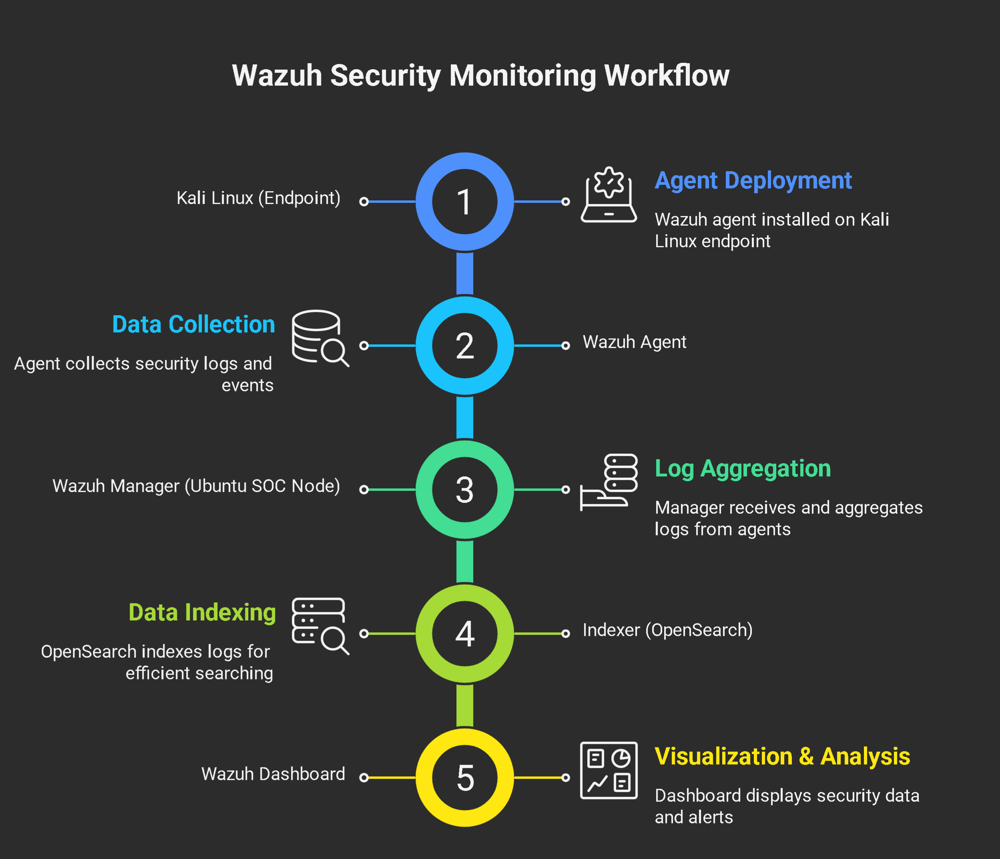

</details>

### Design Considerations

This architecture was intentionally built to:

* Operate within limited hardware (4GB SOC VM RAM)
* Maintain isolation from the external network
* Simulate centralized log aggregation
* Support realistic endpoint onboarding workflows
* Provide clear visibility into log ingestion and alert generation

---

## 4. Network Configuration

All VMs are configured using **NAT networking mode** within VMware Workstation, placing them within the same internal subnet while retaining outbound internet access through the host.

### Subnet Configuration

| Setting | Value |
|---|---|
| Network Range | `192.168.1.0/24` |
| Subnet Mask | `255.255.255.0` |
| Gateway | Provided by VMware NAT service |
| Internet Access | Routed through host system |

<details>
<summary>📸 <strong>VMware NAT virtual network configuration</strong></summary>

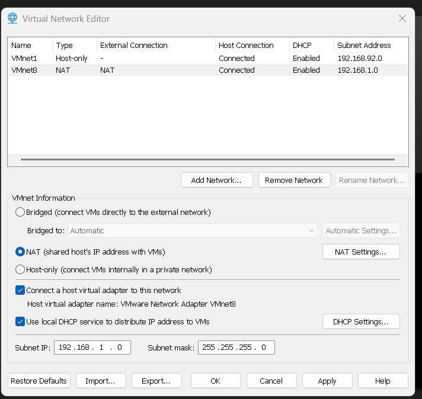

</details>

### Why NAT Was Chosen

* Isolated internal communication between VMs
* Safe simulation within a controlled subnet
* Internet access for package installation and updates
* Clean separation from the physical LAN

### Required Communication Paths

| Path | Purpose |
|---|---|
| Kali → Ubuntu SOC Server (1514, 1515) | Agent registration and log forwarding |
| Ubuntu → Internal OpenSearch services | Log indexing |
| Host Browser → Dashboard (443) | HTTPS dashboard access |

---

## 5. Lab Environment Configuration

### 5.1 Host Virtualization Platform

The SOC lab runs on **VMware Workstation**, chosen for its stable NAT networking, flexible resource allocation, reliable performance under constrained hardware, and snapshot support for safe testing and rollback.

### 5.2 Operating System Selection

The primary SOC server runs **Ubuntu Server 22.04 LTS** — selected for its long-term support stability, lightweight footprint, strong compatibility with security tooling, and wide adoption in enterprise environments.

### 5.3 Ubuntu SOC Server Specifications

| Resource | Allocation |
|---|---|
| RAM | 4 GB |
| CPU | 2 Cores |
| Disk | 40 GB |
| Network | VMnet8 (NAT) |

<details>
<summary>📸 <strong>VMware VM resource allocation settings</strong></summary>

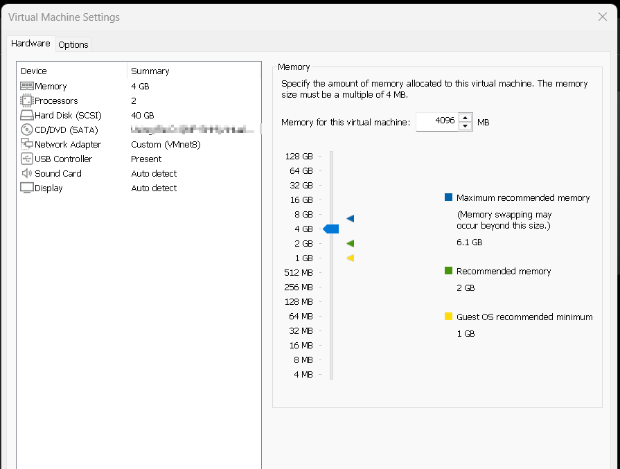

</details>

### 5.4 Disk Allocation During Installation

<details>
<summary>📸 <strong>Disk configuration during Ubuntu installation</strong></summary>

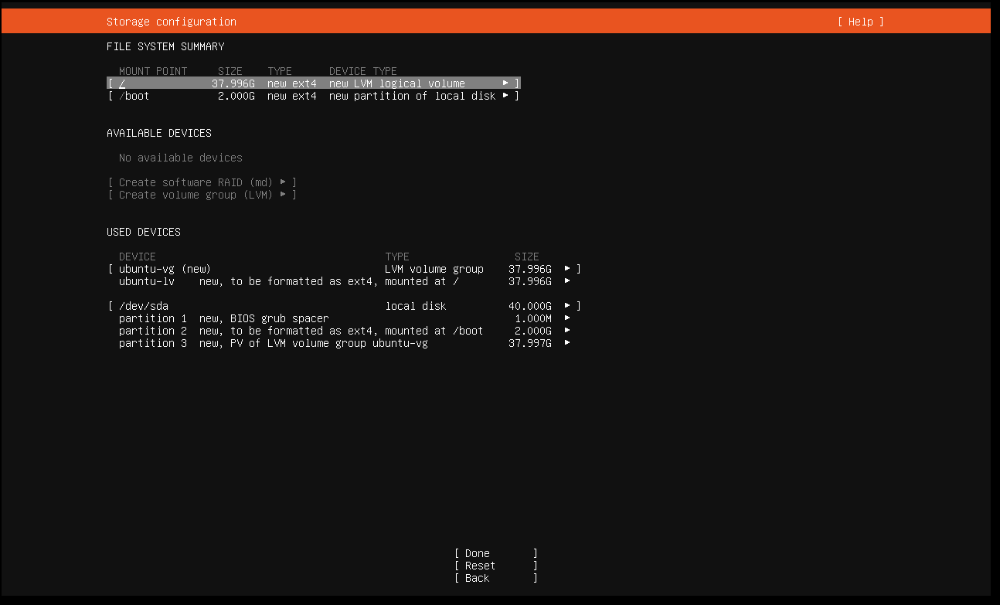

</details>

### 5.5 SSH Configuration

<details>
<summary>📸 <strong>OpenSSH Server enabled during installation</strong></summary>

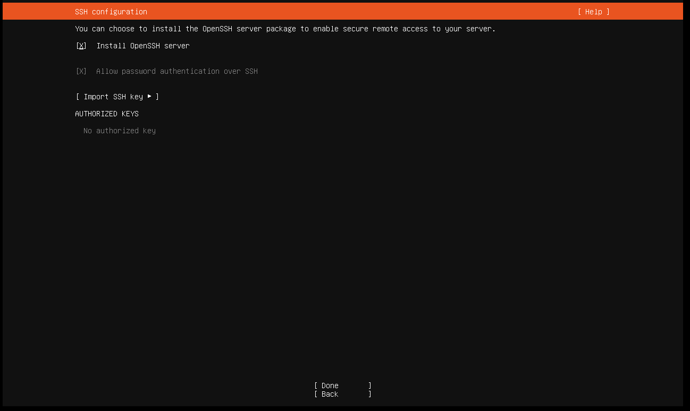

</details>

### 5.6 System Verification After Installation

<details>
<summary>📸 <strong>Post-installation system verification</strong></summary>

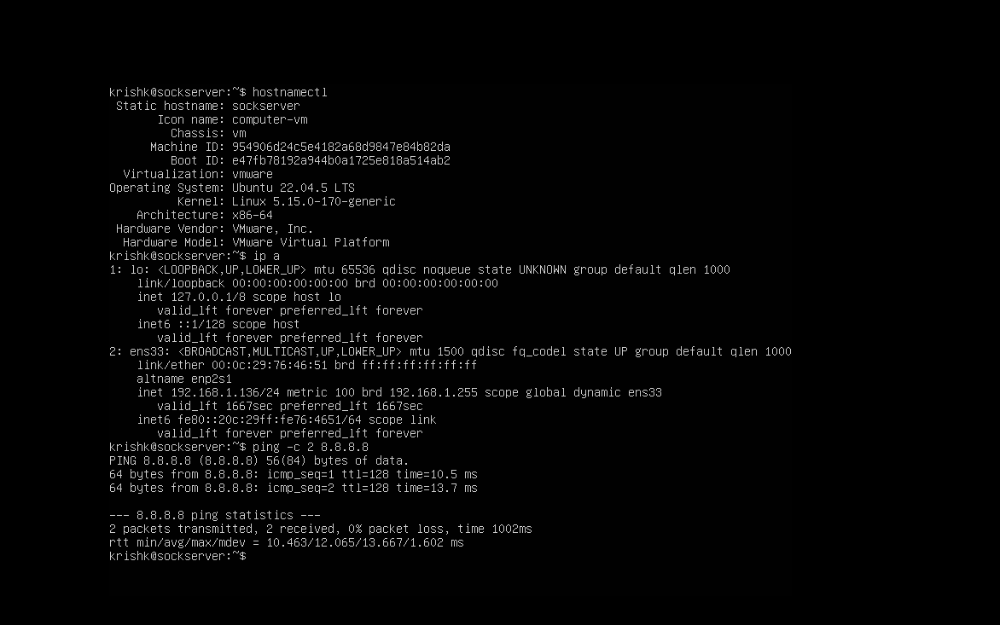

</details>

---

## 6. Server Hardening & Initial Setup

Before deploying Wazuh, the Ubuntu SOC server was updated, cleaned, and minimally hardened to establish a secure and stable baseline.

### 6.1 System Update and Package Upgrade

```bash
sudo apt update
sudo apt upgrade -y
```

<details>
<summary>📸 <strong>System update and upgrade completed</strong></summary>

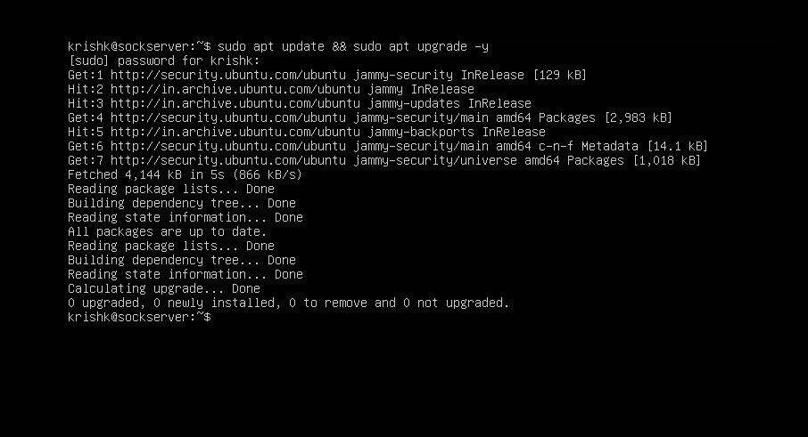

</details>

### 6.2 Removal of Unnecessary Snap Packages

<details>
<summary>📸 <strong>Unnecessary snap packages removed</strong></summary>


</details>

### 6.3 Firewall Baseline Configuration (UFW)

```bash
sudo ufw allow OpenSSH
sudo ufw enable
```

<details>
<summary>📸 <strong>UFW active — SSH only permitted</strong></summary>

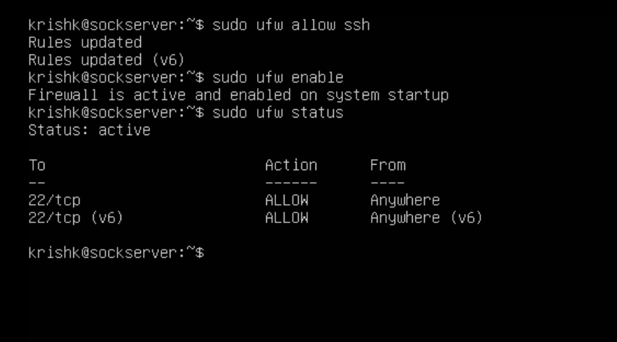

</details>

### 6.4 SSH Service Verification

```bash
sudo systemctl status ssh
```

<details>
<summary>📸 <strong>SSH service confirmed active and running</strong></summary>

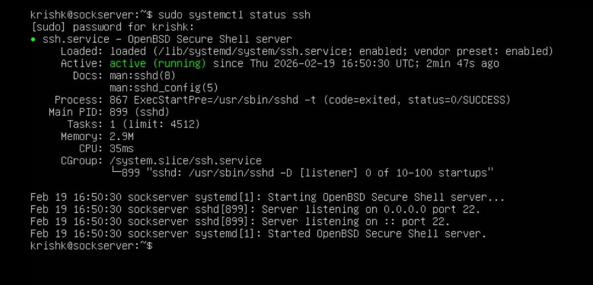

</details>

### 6.5 Network Configuration Verification

```bash
ip a
```

<details>
<summary>📸 <strong>Server IP confirmed within NAT subnet</strong></summary>


</details>

### 6.6 Resource Validation

```bash
free -h
df -h
```

<details>
<summary>📸 <strong>Memory and disk resources verified</strong></summary>

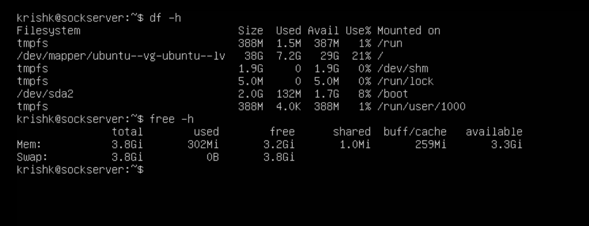

</details>

### Hardening Summary

| Step | Status |
|---|---|
| System update & upgrade | ✅ Complete |
| Unnecessary snap removal | ✅ Complete |
| UFW firewall configured (SSH only) | ✅ Complete |
| SSH service verified | ✅ Complete |
| Network & IP validated | ✅ Complete |
| Resources verified | ✅ Complete |

---

## 7. Wazuh SIEM Installation & Configuration

### 7.1 Installation Script Download

```bash
curl -O https://packages.wazuh.com/4.14/wazuh-install.sh
```

<details>
<summary>📸 <strong>Wazuh installation script downloaded</strong></summary>

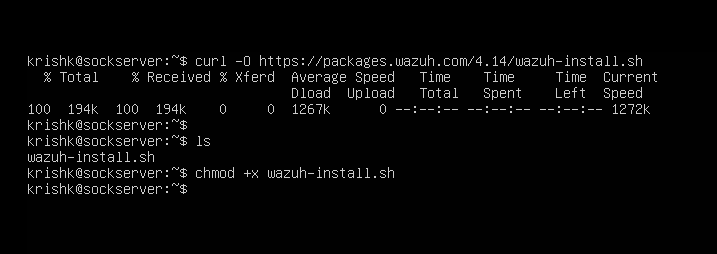

</details>

### 7.2 Executing the All-in-One Installation

```bash
chmod +x wazuh-install.sh
sudo ./wazuh-install.sh -a
```

<details>
<summary>📸 <strong>Wazuh all-in-one installation in progress</strong></summary>

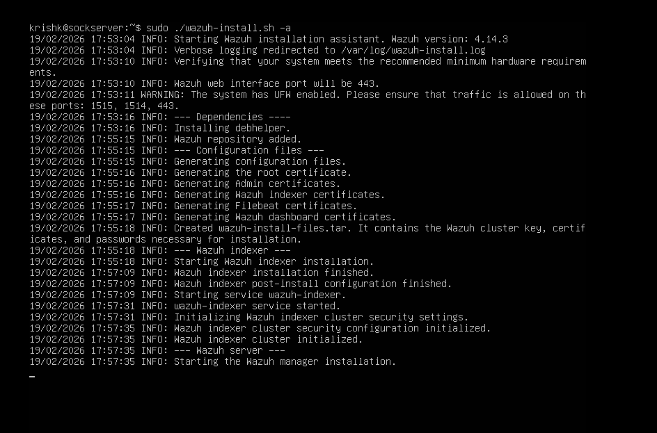

</details>

### 7.3 Dashboard Credential Generation

<details>
<summary>📸 <strong>Dashboard credentials generated on completion</strong></summary>

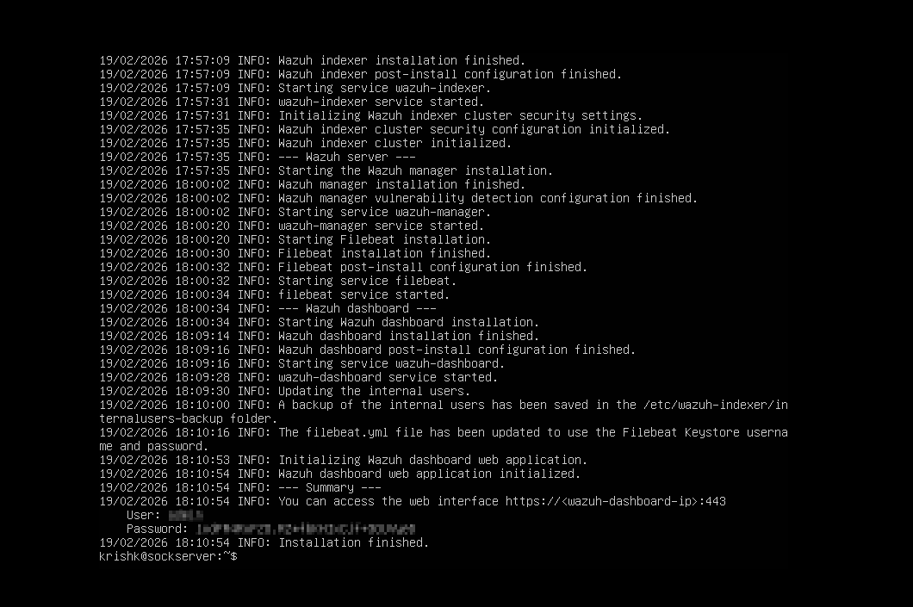

</details>

### 7.4 Service Verification

```bash
sudo systemctl status wazuh-manager
sudo systemctl status wazuh-dashboard
sudo systemctl status wazuh-indexer
sudo systemctl status filebeat
```

<details>
<summary>📸 <strong>All Wazuh services active and running</strong></summary>

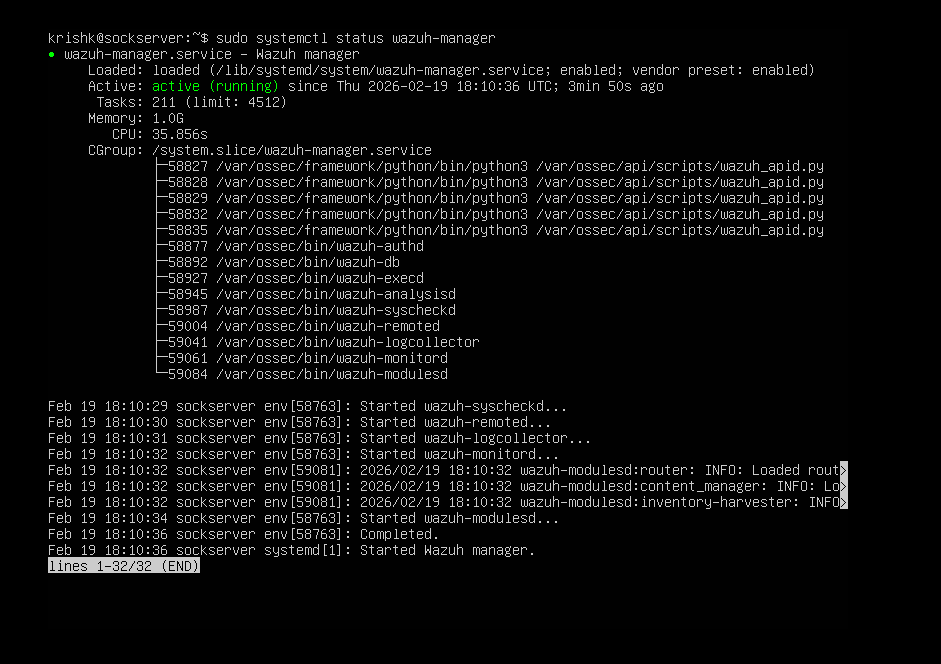

</details>

### 7.5 Firewall Rule Expansion

```bash
sudo ufw allow 443/tcp
```

<details>
<summary>📸 <strong>Port 443 opened — UFW rules updated</strong></summary>

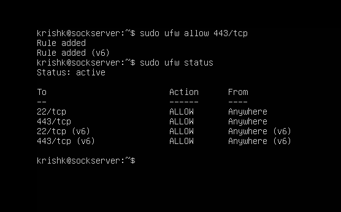

</details>

### 7.6 Dashboard Access & Verification

<details>
<summary>📸 <strong>Wazuh Dashboard login page — reachable over HTTPS</strong></summary>

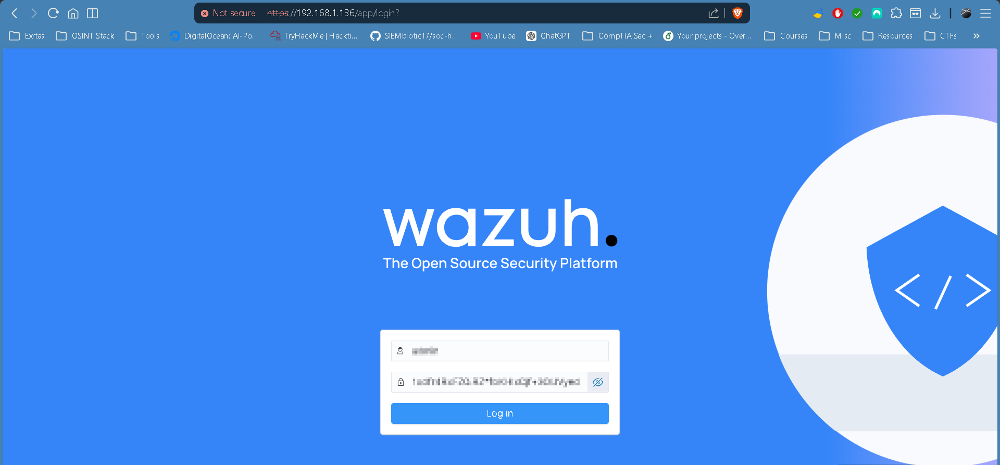

</details>

<details>
<summary>📸 <strong>Wazuh Dashboard home — all components operational</strong></summary>

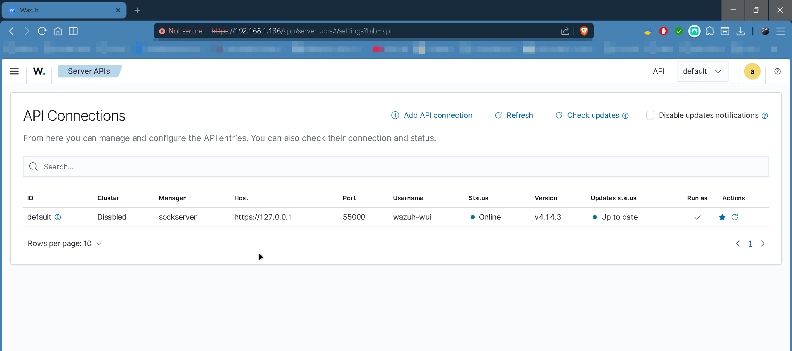

</details>

---

## 8. Agent Deployment & Log Onboarding

### 8.1 Kali Linux VM Configuration

| Resource | Allocation |
|---|---|
| RAM | 2 GB |
| CPU | 2 Cores |
| Disk | 30 GB |
| Network | VMnet8 (NAT) |

<details>
<summary>📸 <strong>Kali Linux VM hardware configuration in VMware</strong></summary>

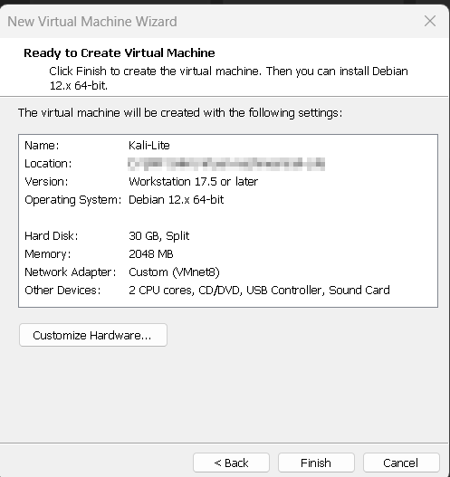

</details>

### 8.2 Network Connectivity Verification

```bash
ip a
ping <server-ip_address>
```

<details>
<summary>📸 <strong>Kali IP address confirmed within NAT subnet</strong></summary>

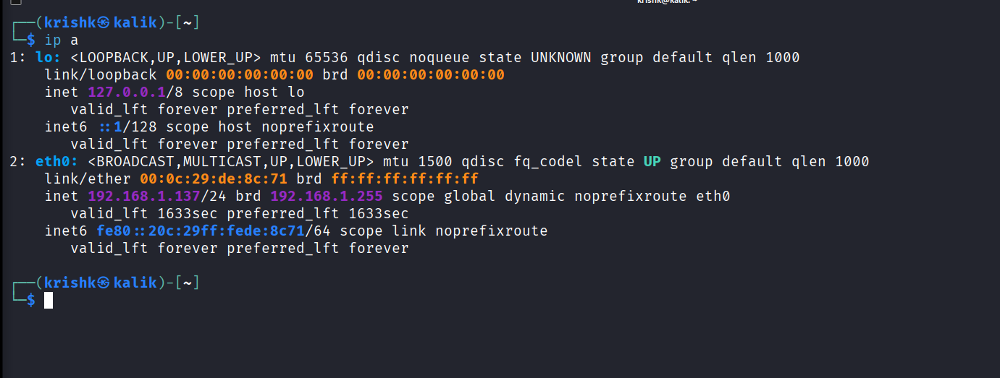

</details>

<details>
<summary>📸 <strong>Ping to Wazuh Manager — ICMP responses confirm connectivity</strong></summary>

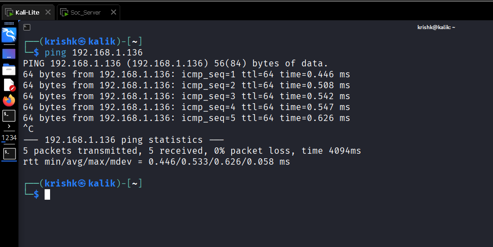

</details>

### 8.3 Installing the Wazuh Agent

```bash
# Add GPG key
curl -s https://packages.wazuh.com/key/GPG-KEY-WAZUH | sudo gpg --dearmor -o /usr/share/keyrings/wazuh.gpg

# Add repository
echo "deb [signed-by=/usr/share/keyrings/wazuh.gpg] https://packages.wazuh.com/4.x/apt stable main" | sudo tee /etc/apt/sources.list.d/wazuh.list

# Install agent pointed at the SOC server
sudo apt update
sudo WAZUH_MANAGER='192.168.1.136' apt install wazuh-agent -y

# Enable and start
sudo systemctl enable wazuh-agent
sudo systemctl start wazuh-agent
```

<details>
<summary>📸 <strong>GPG key added — Wazuh repository authenticated</strong></summary>

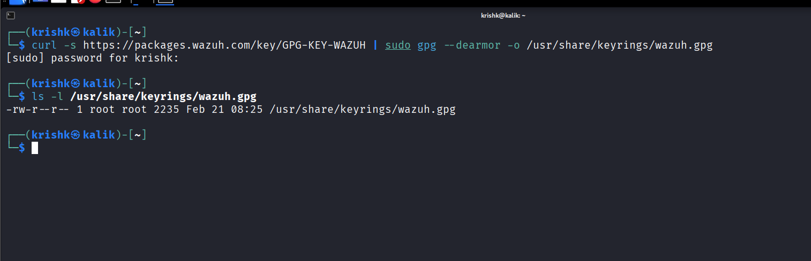

</details>

<details>
<summary>📸 <strong>Wazuh repository added to apt sources</strong></summary>

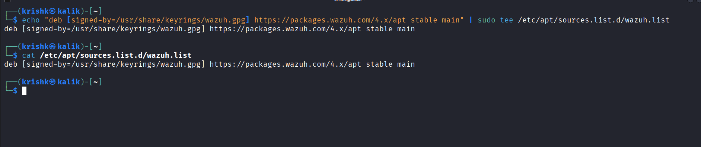

</details>

<details>
<summary>📸 <strong>Wazuh agent installed successfully</strong></summary>

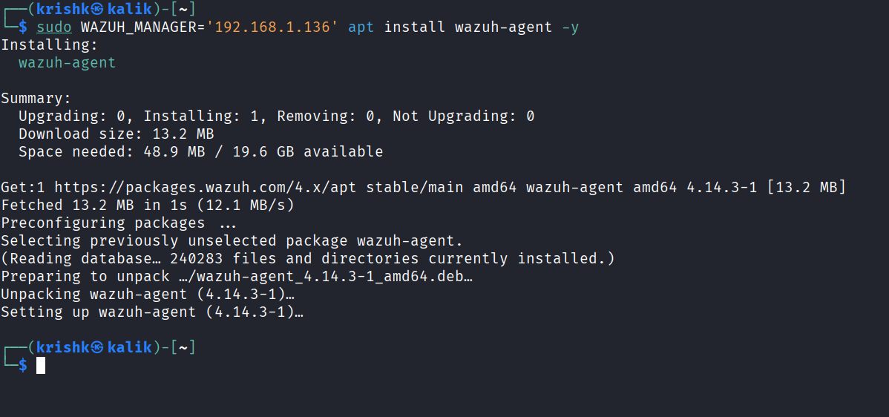

</details>

<details>
<summary>📸 <strong>Wazuh agent service running on Kali endpoint</strong></summary>

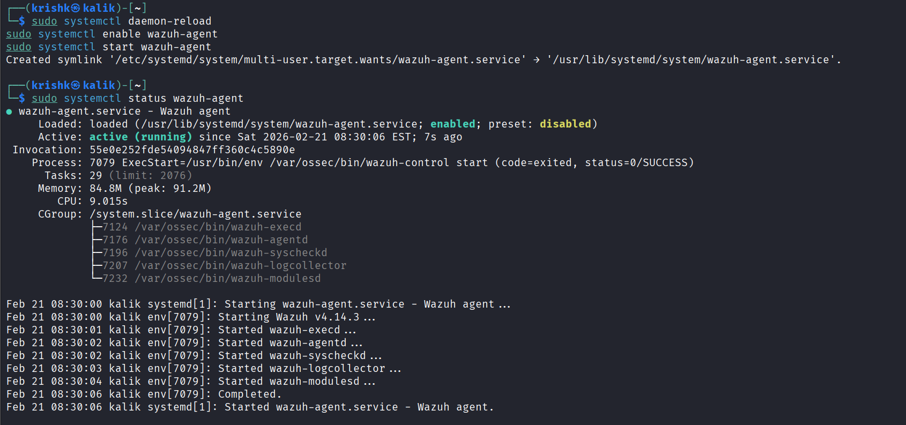

</details>

### 8.4 Secure Agent Registration (Key-Based Authentication)

```bash
sudo /var/ossec/bin/manage_agents
```

<details>
<summary>📸 <strong>Kali agent added — authentication key generated</strong></summary>

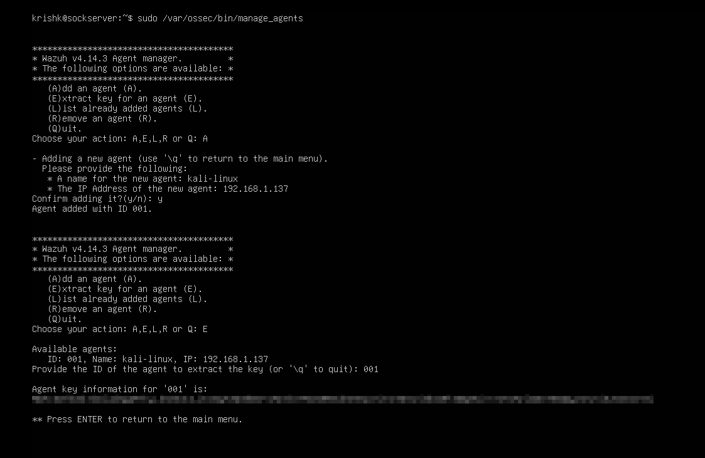

</details>

<details>
<summary>📸 <strong>Authentication key imported on Kali endpoint</strong></summary>

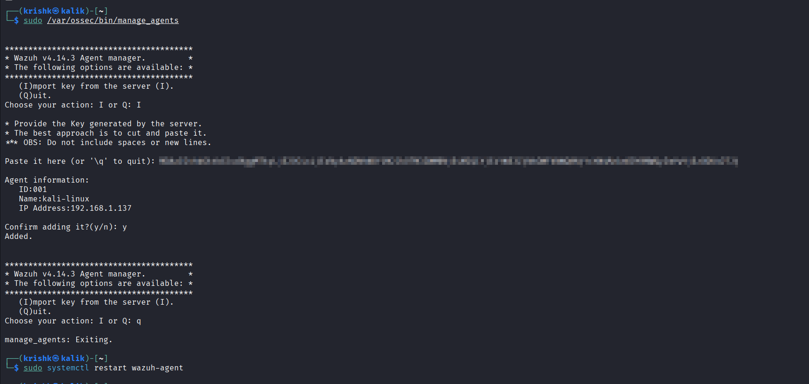

</details>

<details>
<summary>📸 <strong>Agent control list — Kali agent Active and communicating</strong></summary>

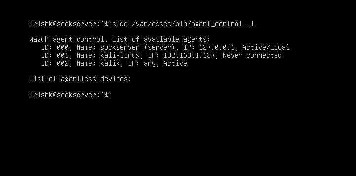

</details>

### 8.5 Firewall Validation for Agent Communication

```bash
sudo ufw allow 1514
sudo ufw allow 1515
```

<details>
<summary>📸 <strong>Ports 1514 and 1515 opened — agent connectivity restored</strong></summary>

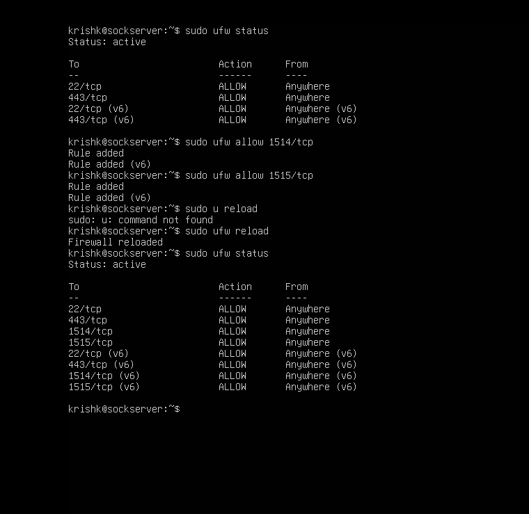

</details>

### 8.6 Dashboard Agent Verification

<details>
<summary>📸 <strong>Kali agent visible in Wazuh Dashboard — status Active</strong></summary>

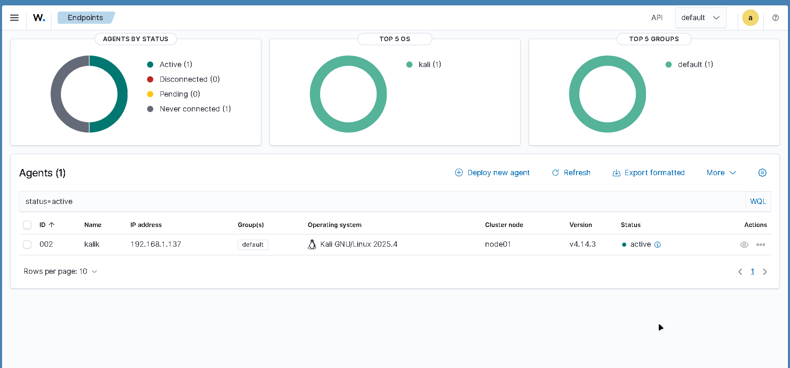

</details>

### 8.7 Log Generation & Event Validation

```bash
sudo su invaliduser
sudo apt install sl -y
```

<details>
<summary>📸 <strong>Authentication events generated on Kali endpoint</strong></summary>

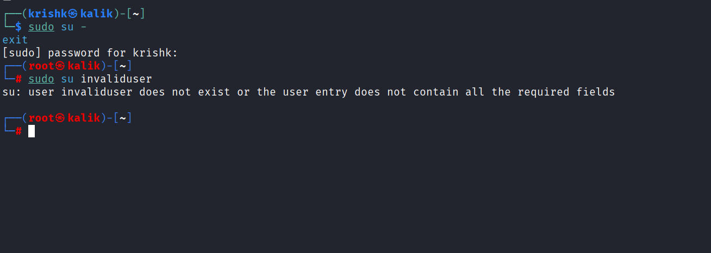

</details>

<details>
<summary>📸 <strong>Package install log generated on Kali endpoint</strong></summary>

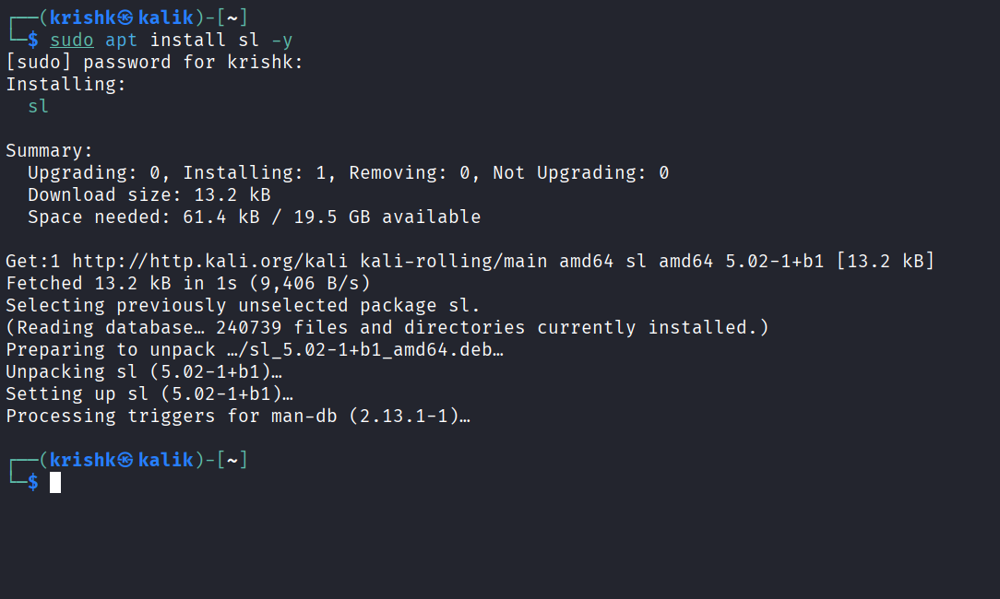

</details>

<details>
<summary>📸 <strong>Wazuh Dashboard — events received and indexed from Kali agent</strong></summary>

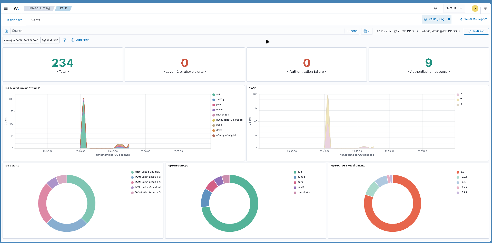

</details>

<details>
<summary>📸 <strong>Wazuh Dashboard — expanded event detail with rule match and timestamp</strong></summary>

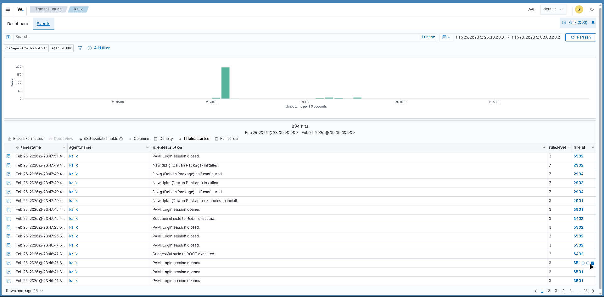

</details>

---

## 9. Attack Simulation & Detection Validation

### 9.1 Authentication Abuse Simulation

**Objective:** Confirm that repeated failed authentication attempts generate alerts and are correctly classified by Wazuh.

```bash
sudo su invaliduser
sudo su invaliduser
sudo su invaliduser
```

<details>
<summary>📸 <strong>Failed authentication attempts executed on Kali</strong></summary>

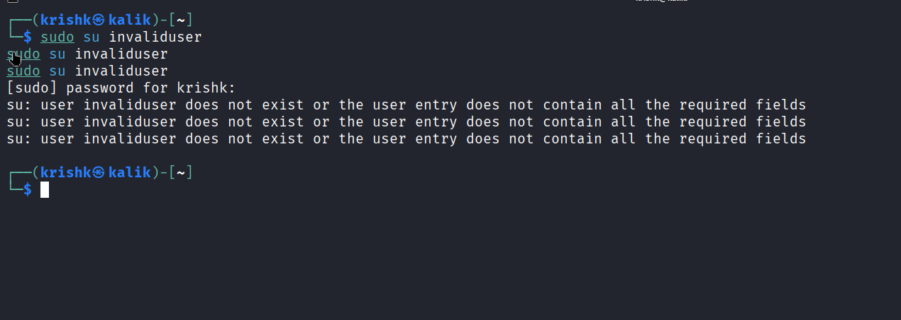

</details>

<details>
<summary>📸 <strong>Wazuh alert — authentication abuse detected</strong></summary>

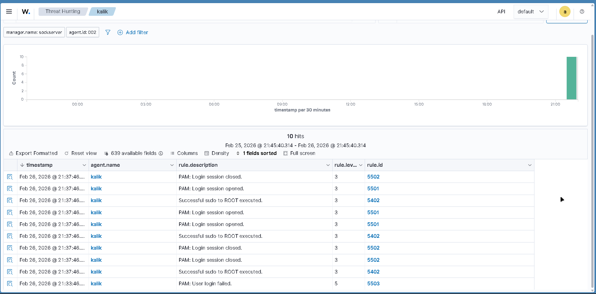

</details>

---

### 9.2 Privilege Escalation Activity

**Objective:** Validate that privileged command execution is logged and surfaced as a security event.

```bash
sudo -l
sudo su -
exit
```

<details>
<summary>📸 <strong>Privilege escalation commands executed on Kali</strong></summary>

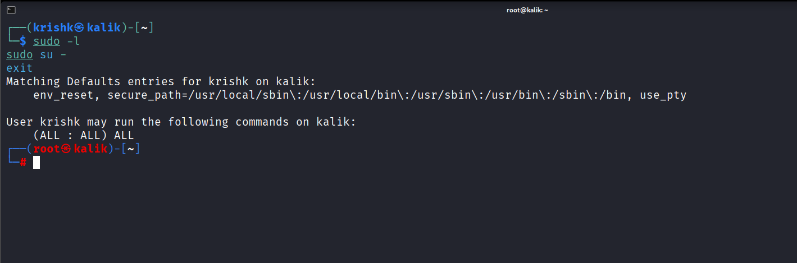

</details>

<details>
<summary>📸 <strong>Wazuh alert — privilege escalation activity detected</strong></summary>

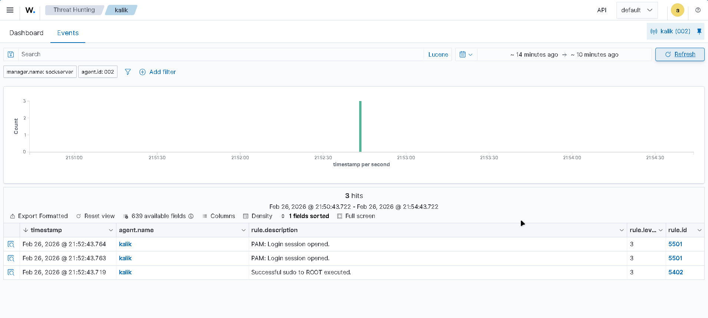

</details>

---

### 9.3 Suspicious Tool Installation

**Objective:** Confirm that package installation events are monitored and logged.

```bash
sudo apt install nmap -y
```

<details>
<summary>📸 <strong>Nmap installation executed on Kali endpoint</strong></summary>

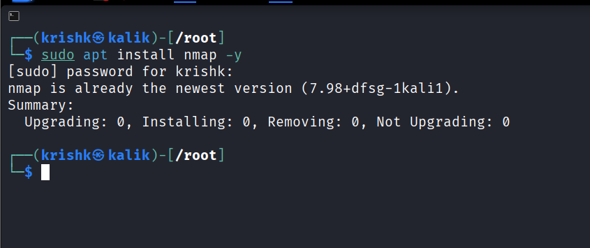

</details>

<details>
<summary>📸 <strong>Wazuh alert — suspicious tool installation detected</strong></summary>

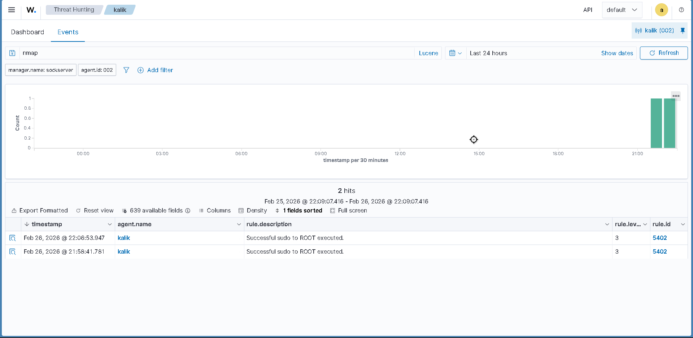

</details>

---

### 9.4 File Integrity Monitoring (FIM) Validation

**Objective:** Verify that Wazuh's File Integrity Monitoring detects modifications to monitored files.

<details>
<summary>📸 <strong>/etc/hosts modified — FIM trigger generated</strong></summary>

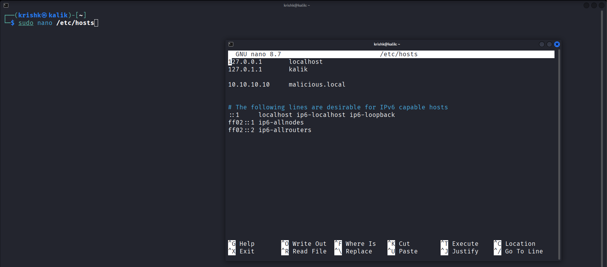

</details>

<details>
<summary>📸 <strong>Wazuh FIM alert — unauthorized file modification detected</strong></summary>

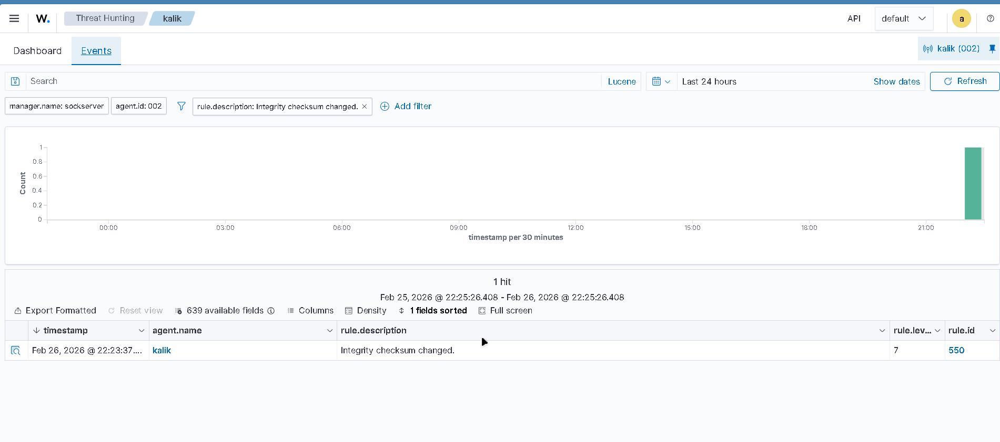

</details>

---

### 9.5 Detection Validation Summary

| Simulation | Alert Generated | Severity Assigned | Agent Attributed | Timestamp Accurate |
|---|---|---|---|---|
| Authentication abuse | ✅ | ✅ | ✅ | ✅ |
| Privilege escalation | ✅ | ✅ | ✅ | ✅ |
| Suspicious tool install | ✅ | ✅ | ✅ | ✅ |
| File integrity violation | ✅ | ✅ | ✅ | ✅ |

---

## 10. Lessons Learned, Limitations & Future Improvements

### 10.1 Controlled Network Architecture Matters

Deploying within a NAT-isolated environment kept the lab clean and predictable. Incremental firewall rule expansion — opening only what each service needed, when it needed it — was a practical discipline that mirrors real SOC deployment hygiene.

**Key takeaways:**
* Proper network segmentation is foundational to effective SOC design
* Minimal service exposure reduces unexpected behaviour and security risk
* Connectivity issues are easier to debug when changes are made incrementally

### 10.2 Resource Constraints in SIEM Deployments

Running the Wazuh all-in-one stack within a 4GB RAM VM made it clear why enterprise deployments use distributed architectures. The indexer is the most resource-hungry component — under normal conditions it was stable, but there was little headroom for spikes in log volume.

**Key takeaways:**
* Capacity planning before deployment prevents instability mid-project
* Log retention strategy directly affects storage consumption over time
* Understanding resource limits early helps make better architectural decisions

### 10.3 Detection Validation Is Not Optional

One of the most valuable lessons from this project: deploying a SIEM does not automatically mean it is detecting correctly. The attack simulation phase was essential — without it, there would be no proof the pipeline actually works end-to-end.

This is the difference between **infrastructure deployment** and **operational readiness** — a distinction that matters significantly in a real SOC environment.

### 10.4 Firewall Troubleshooting Is Part of the Process

The agent registration issue caused by blocked ports 1514 and 1515 was a practical reminder that security tooling often fails silently when network paths are blocked. Systematic troubleshooting — checking connectivity, then firewall rules, then service logs — resolved it efficiently.

### 10.5 Current Limitations

| Limitation | Impact |
|---|---|
| Single Linux endpoint only | No Windows telemetry, registry events, or process-level data |
| No log volume stress testing | Scalability under real-world conditions unvalidated |
| No EDR-level telemetry | Kernel-level and behavioural detection not included |
| Self-signed SSL certificate | Not production-ready; browser warnings in all sessions |

### 10.6 Future Improvements

| Enhancement | Purpose |
|---|---|
| Add Windows VM + Sysmon | Process creation, registry, and persistence detection |
| Deploy Suricata IDS | Network-layer signature-based detection |
| Threat intelligence integration | IP reputation, domain blacklist, GeoIP enrichment |
| Custom detection rules + tuning | Reduce false positives, improve signal quality |
| Distributed Wazuh architecture | Separate Manager, Indexer, and Dashboard for scalability |

---

## 11. Final Project Conclusion

This project successfully delivered a fully deployed, validated, and operational SOC home lab using Wazuh SIEM.

**Capabilities confirmed through this project:**

* Endpoint onboarding and secure key-based agent registration
* Real-time log ingestion and OpenSearch indexing
* Alert generation and dashboard visibility
* File integrity monitoring
* Privilege escalation event detection
* Authentication abuse detection
* End-to-end pipeline validation through controlled simulations

The environment provides a solid and documented foundation for advanced detection engineering, blue-team exercises, and future SOC lab expansion across the remaining phases of this series.

---

<p align="center">
  <sub>
    Part of the <strong>SOC Home Lab Series</strong> by <a href="https://github.com/sockr17">Krish Patel</a><br><br>
    <a href="../phase-1-wazuh-deployment">Phase 1: SIEM Infrastructure</a> ✅ &nbsp;|&nbsp;
    <a href="../phase-2-windows-sysmon">Phase 2: Windows + Sysmon</a> ✅ &nbsp;|&nbsp;
    <a href="../phase-3-attack-simulation">Phase 3: Attack Simulation</a> ✅
  </sub>
</p>
