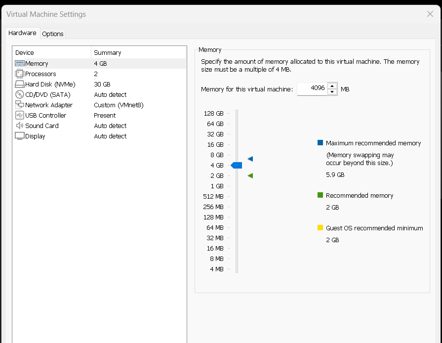
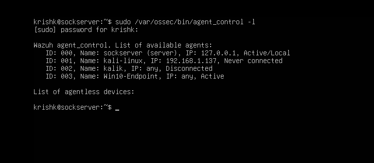
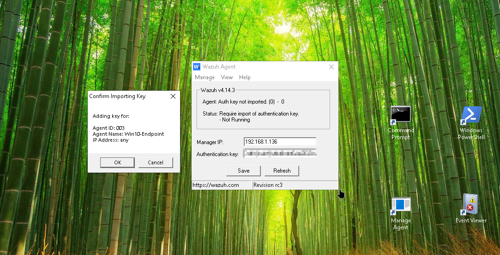
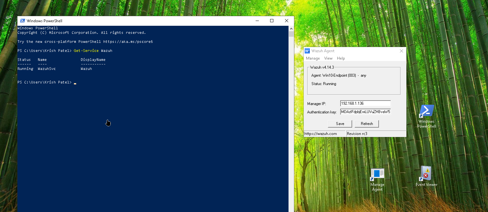
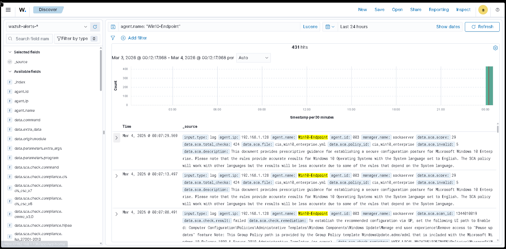
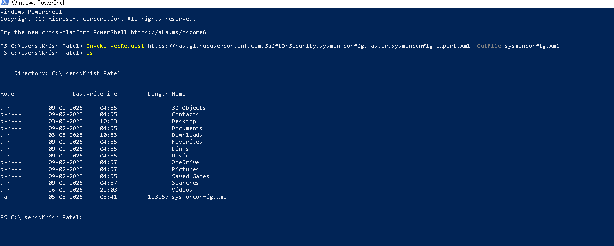
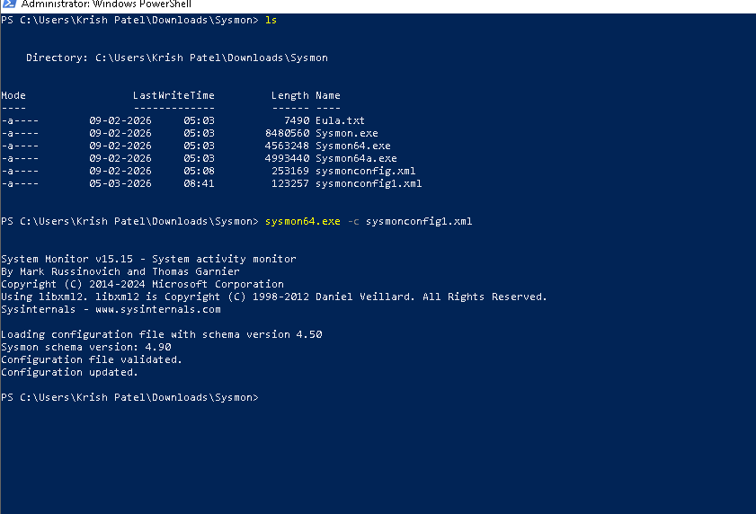
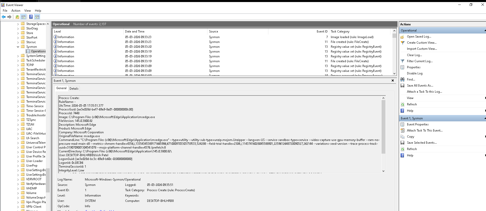
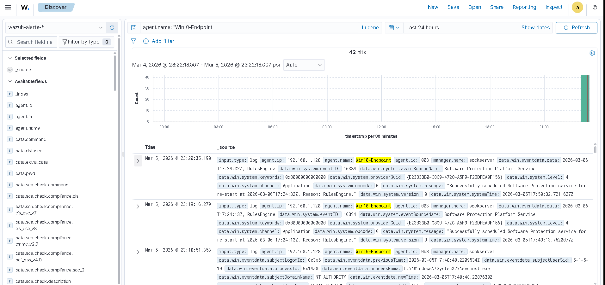

# SOC Home Lab – Phase 2: Windows Telemetry & Sysmon Integration

*Windows Endpoint Integration | Security Event Monitoring | Sysmon Telemetry*

<p align="center">

[](https://ubuntu.com/)
[](https://microsoft.com)
[](https://wazuh.com/)
[](https://github.com/SwiftOnSecurity/sysmon-config)
[](https://www.vmware.com/)
[](https://github.com/kripy17)
[](https://github.com/kripy17)

</p>

---

<div align="center">

| 🖥️ Windows Endpoint | 🔬 Sysmon Events | 🔗 Pipeline Status | 🛠️ Log Sources |
|:---:|:---:|:---:|:---:|
| 1 | 6 types monitored | ✅ Operational | Windows Events + Sysmon |

</div>

---

## 📋 Table of Contents

<details open>
<summary>📸 <strong>🖥️ Agent Onboarding</strong></summary>

&nbsp;&nbsp;&nbsp;&nbsp;`01` [Project Overview](#1-project-overview)  
&nbsp;&nbsp;&nbsp;&nbsp;`02` [Lab Objectives & Initial Agent Onboarding](#2-lab-objectives--initial-agent-onboarding)  
&nbsp;&nbsp;&nbsp;&nbsp;&nbsp;&nbsp;&nbsp;&nbsp;`2.1` [Windows VM Configuration](#21-windows-vm-configuration)  
&nbsp;&nbsp;&nbsp;&nbsp;&nbsp;&nbsp;&nbsp;&nbsp;`2.2` [Verify SOC Server Services](#22-verify-soc-server-services)  
&nbsp;&nbsp;&nbsp;&nbsp;&nbsp;&nbsp;&nbsp;&nbsp;`2.3` [Confirm Required Ports Are Listening](#23-confirm-required-ports-are-listening)  
&nbsp;&nbsp;&nbsp;&nbsp;&nbsp;&nbsp;&nbsp;&nbsp;`2.4` [Register the Windows Agent](#24-register-the-windows-agent)  
&nbsp;&nbsp;&nbsp;&nbsp;&nbsp;&nbsp;&nbsp;&nbsp;`2.5` [Configure and Start Windows Agent](#25-configure-and-start-windows-agent)  
&nbsp;&nbsp;&nbsp;&nbsp;&nbsp;&nbsp;&nbsp;&nbsp;`2.6` [Verify Telemetry & Log Flow](#26-verify-telemetry--log-flow)  

</details>

<details open>
<summary>📸 <strong>🔬 Sysmon Integration</strong></summary>

&nbsp;&nbsp;&nbsp;&nbsp;`03` [Sysmon Configuration for Enhanced Endpoint Telemetry](#3-sysmon-configuration-for-enhanced-endpoint-telemetry)  
&nbsp;&nbsp;&nbsp;&nbsp;&nbsp;&nbsp;&nbsp;&nbsp;`3.1` [Sysmon Configuration File](#31-sysmon-configuration-file)  
&nbsp;&nbsp;&nbsp;&nbsp;&nbsp;&nbsp;&nbsp;&nbsp;`3.2` [Applying the Configuration](#32-applying-the-configuration)  
&nbsp;&nbsp;&nbsp;&nbsp;&nbsp;&nbsp;&nbsp;&nbsp;`3.3` [Verifying Sysmon Event Logs in Event Viewer](#33-verifying-sysmon-event-logs-in-event-viewer)  
&nbsp;&nbsp;&nbsp;&nbsp;&nbsp;&nbsp;&nbsp;&nbsp;`3.4` [Integration with Wazuh](#34-integration-with-wazuh)  
&nbsp;&nbsp;&nbsp;&nbsp;&nbsp;&nbsp;&nbsp;&nbsp;`3.5` [Telemetry Validation](#35-telemetry-validation)  

</details>

<details open>
<summary>📸 <strong>📊 Reflection & Summary</strong></summary>

&nbsp;&nbsp;&nbsp;&nbsp;`04` [Telemetry Pipeline](#4-telemetry-pipeline)  
&nbsp;&nbsp;&nbsp;&nbsp;`05` [Lessons Learned](#5-lessons-learned)  
&nbsp;&nbsp;&nbsp;&nbsp;`06` [Known Limitations](#6-known-limitations)  
&nbsp;&nbsp;&nbsp;&nbsp;`07` [Phase Summary](#7-phase-summary)  

</details>

---

## 1. Project Overview

This repository documents the second phase of my **Security Operations Center (SOC) home lab**, focused on expanding monitoring capabilities to include Windows-based telemetry.

Following the successful deployment of a centralized SIEM infrastructure in [Phase 1](../phase-1-wazuh-deployment), this phase integrates a **Windows 10 endpoint** into the existing Wazuh environment to enhance visibility into operating system–level security events.

Phase 1 established the foundation — a fully operational Wazuh stack monitoring a Kali Linux endpoint. Phase 2 extends that foundation by onboarding a Windows machine, which introduces an entirely different category of telemetry: **Windows Event Logs, registry activity, process creation chains, and network connection tracking** — all critical signals in real SOC environments.

**The objectives of this phase are:**

* Deploy and register a Windows Wazuh agent into the existing SOC infrastructure
* Monitor native Windows Security Event logs through the Wazuh Dashboard
* Integrate and configure **Sysmon** for enhanced process-level telemetry
* Validate centralized log ingestion from the Windows endpoint
* Troubleshoot agent registration and connectivity issues as they arise

By incorporating Sysmon telemetry, this phase transitions the lab from foundational Linux-based log collection into **detailed Windows endpoint monitoring** — including process creation, command-line execution, and persistence-related events commonly investigated in real SOC workflows.

> 📌 **Back to main project:** [SOC Home Lab](../README.md)

---

## 2. Lab Objectives & Initial Agent Onboarding

This phase focuses on **onboarding a Windows 10 endpoint** into the existing Wazuh SOC infrastructure and validating that telemetry is successfully forwarded to the SOC server.

Before any Sysmon configuration or attack simulation can take place, the agent pipeline must be fully operational. A broken or misconfigured agent silently drops logs — meaning detections fail without any obvious error. Getting this right first is fundamental SOC hygiene.

**Primary objectives:**

* Verify SOC server services are operational before onboarding
* Confirm required network ports for Wazuh communication are open
* Register the Windows agent securely using the Wazuh GUI
* Start and validate the agent service on the Windows VM
* Confirm the agent is active and communicating with the SOC server
* Verify telemetry and log flow is functional end-to-end

---

### 2.1 Windows VM Configuration

The Windows 10 endpoint VM is configured to balance realism with host system constraints. Running the Wazuh SOC server alongside a Windows VM on 8GB total host RAM requires careful resource allocation to keep both machines stable.

| Resource | Allocation |
|---|---|
| RAM | 4 GB |
| CPU | 2 Cores |
| Disk | 40 GB |
| Network | VMnet8 (NAT) |
| Sysmon | Installed |

<details>
<summary>📸 <strong>Windows VM resource allocation</strong></summary>



</details>

This allocation gives the Windows VM enough headroom to run Sysmon and the Wazuh agent simultaneously while keeping the host system stable. The NAT network places the Windows endpoint on the same internal subnet as the SOC server, enabling direct agent-to-manager communication.

---

### 2.2 Verify SOC Server Services

Before onboarding any new agent, all Wazuh services on the SOC server must be confirmed as running. A degraded or stopped component at this stage would cause agent registration to fail silently — making this verification step critical before proceeding.

<details>
<summary>📸 <strong>Wazuh services running — output 1</strong></summary>


</details>

<details>
<summary>📸 <strong>Wazuh services running — output 2</strong></summary>


</details>

**Services verified:**

| Service | Role |
|---|---|
| Wazuh Manager | Receives and processes agent logs |
| Wazuh Indexer (OpenSearch) | Indexes and stores events |
| Wazuh Dashboard | Visualizes telemetry and alerts |
| Filebeat | Forwards logs to the indexer |

All four services returned `active (running)` before agent onboarding began.

---

### 2.3 Confirm Required Ports Are Listening

Wazuh agent communication depends on specific ports being open on the SOC server. These were verified to be listening before the Windows agent was registered — a step learned from Phase 1, where blocked ports caused silent registration failures.

| Port | Purpose |
|---|---|
| **1514** | Agent data communication |
| **1515** | Agent registration |
| **443** | Wazuh Dashboard HTTPS access |

<details>
<summary>📸 <strong>Required ports confirmed listening</strong></summary>


</details>

All required ports confirmed as listening and reachable from the Windows VM.

---

### 2.4 Register the Windows Agent

The Windows agent was registered through the **Wazuh Dashboard GUI**, which generates a unique authentication key for the endpoint. This key-based approach ensures only authorised agents can forward logs to the SIEM — preventing unauthorised data injection.

<details>
<summary>📸 <strong>Windows agent created in Wazuh Dashboard</strong></summary>


</details>

<details>
<summary>📸 <strong>Windows agent status — Active on server</strong></summary>



</details>

The agent was assigned a unique ID and its status transitioned to **Active** once the connection was established from the Windows VM side.

---

### 2.5 Configure and Start Windows Agent

With the agent registered, the Wazuh agent on the Windows VM was configured with the SOC server's IP address and the generated authentication key, then started as a Windows service.

<details>
<summary>📸 <strong>Wazuh agent configured in Windows GUI</strong></summary>



</details>

<details>
<summary>📸 <strong>Wazuh agent service running on Windows VM</strong></summary>



</details>

The service started successfully and began communicating with the Wazuh Manager over port 1514.

---

### 2.6 Verify Telemetry & Log Flow

With the agent active, the Wazuh Dashboard was checked to confirm that Windows event logs were successfully arriving at the SOC server. This end-to-end check validates the full pipeline — from Windows endpoint through the agent to the Wazuh Manager and into the Dashboard.

<details>
<summary>📸 <strong>Telemetry log flow verified in Wazuh Dashboard</strong></summary>



</details>

**Validation confirmed:**

* Windows endpoint logs are successfully forwarded to the SOC server
* Wazuh Manager is receiving and indexing the events
* Events are visible in the Wazuh Dashboard under the Windows agent

With the agent pipeline fully operational, the environment is ready for Sysmon integration.

---

## 3. Sysmon Configuration for Enhanced Endpoint Telemetry

### Objective

With the Windows agent successfully forwarding logs, the next step is dramatically improving the **quality** of that telemetry. Out of the box, Windows Event Logs provide basic visibility — login events, service changes, audit logs. But they miss the detail that matters most in a SOC environment: exactly what processes ran, what commands were executed, what network connections were made, and what registry keys were touched.

**Sysmon (System Monitor)** fills that gap. Once configured, it becomes the primary source of high-fidelity endpoint telemetry — the kind of data that makes the difference between detecting an attack and missing it entirely.

---

### Why Sysmon Is Important

Default Windows logging provides limited visibility into system activity. Sysmon enhances endpoint monitoring by generating detailed event logs tied to specific system behaviors that attackers cannot easily hide.

| Sysmon Event | Event ID | What It Captures |
|---|---|---|
| Process Creation | 1 | Every process launched, its command line, and parent process |
| Network Connection | 3 | Outbound connections with source/destination IP and port |
| File Creation | 11 | Files written to disk with full path |
| Registry Modification | 13 | Registry value changes — key for persistence detection |
| Driver Load | 6 | Drivers loaded into the kernel |
| Process Injection | 8 | CreateRemoteThread calls between processes |

This level of visibility is what separates basic log collection from **real endpoint detection capability** — and is the standard telemetry source used by SOC teams in enterprise environments.

---

### 3.1 Sysmon Configuration File

Installing Sysmon alone is not enough — without a configuration file, it either logs everything (creating enormous noise) or almost nothing useful. A well-structured config defines exactly what to capture and what to filter out.

Sysmon was configured using the **SwiftOnSecurity Sysmon configuration** — one of the most widely adopted open-source Sysmon configs in the security community. It is actively maintained and used as a baseline in real SOC environments.

The config was downloaded directly from the official SwiftOnSecurity GitHub repository:

```
https://github.com/SwiftOnSecurity/sysmon-config
```

This configuration provides a well-balanced ruleset that:

* Enables logging for all high-value security events
* Filters low-value noise to reduce unnecessary log volume
* Covers process creation, network connections, registry changes, and more
* Is regularly updated to reflect current threat detection best practices

<details>
<summary>📸 <strong>SwiftOnSecurity Sysmon config downloaded</strong></summary>



</details>

---

### 3.2 Applying the Configuration

The configuration file was applied to Sysmon using an elevated **PowerShell** session. The `-c` flag instructs Sysmon to load the specified configuration file and immediately begin logging according to its ruleset:

```powershell
sysmon64.exe -c sysmonconfig.xml
```

<details>
<summary>📸 <strong>Sysmon configuration applied successfully</strong></summary>



</details>

Sysmon confirmed the configuration was accepted and began generating telemetry events immediately. No restart was required — the new ruleset takes effect in real time.

---

### 3.3 Verifying Sysmon Event Logs in Event Viewer

Once the configuration was applied, Sysmon telemetry was verified directly in **Windows Event Viewer** before checking Wazuh. This two-step validation approach confirms whether an issue lies on the Windows side or the forwarding side — making troubleshooting significantly easier.

Sysmon events are located under:

```
Applications and Services Logs
└── Microsoft
    └── Windows
        └── Sysmon
            └── Operational
```

<details>
<summary>📸 <strong>Sysmon event logs visible in Event Viewer</strong></summary>



</details>

**Event ID 1 (Process Creation)** events were immediately visible, generated by normal system activity — confirming Sysmon is actively monitoring the endpoint and the configuration was applied correctly.

---

### 3.4 Integration with Wazuh

With Sysmon generating telemetry, the existing Wazuh agent on the Windows endpoint automatically picks up the Sysmon event channel and forwards those logs to the SOC server alongside standard Windows Event Logs.

This means no additional agent configuration was required — the Wazuh agent already monitors the Windows Event Log channels, and Sysmon writes directly into the Windows event log infrastructure under its own dedicated channel.

Once ingested, Sysmon telemetry can be:

* **Indexed and stored** in the Wazuh Indexer (OpenSearch)
* **Monitored** through the Wazuh Security Events dashboard
* **Correlated** with other security events across agents
* **Matched** against Wazuh detection rules for alert generation

This gives the SOC server complete visibility into endpoint-level activity — from basic Windows events through to detailed process execution chains.

---

### 3.5 Telemetry Validation

To confirm that Sysmon telemetry was successfully reaching the SIEM, events generated on the Windows endpoint were traced through to the **Wazuh Security Events dashboard**.

<details>
<summary>📸 <strong>Sysmon logs visible in Wazuh Dashboard</strong></summary>



</details>

**Validation confirmed:**

* Sysmon events are being forwarded by the Windows Wazuh agent
* The Wazuh Manager is receiving and processing Sysmon telemetry
* Events are indexed and visible in the dashboard with correct attribution
* The full pipeline from endpoint activity to SIEM visibility is operational

---

### Outcome

With Sysmon properly configured and integrated with Wazuh, the SOC lab now has **significantly enhanced Windows endpoint visibility** — moving beyond basic event logs into detailed process-level telemetry.

| Capability | Before Sysmon | After Sysmon |
|---|---|---|
| Process execution visibility | ❌ Limited | ✅ Full command-line detail |
| Network connection tracking | ❌ None | ✅ Per-process with IP/port |
| Registry change detection | ❌ None | ✅ Key-level granularity |
| Parent-child process chains | ❌ None | ✅ Full lineage tracking |
| File creation events | ❌ None | ✅ Full path logging |

This telemetry foundation will be used in **Phase 3** to simulate real attack techniques on the Windows endpoint, generate detectable events, and practice SOC analyst investigation workflows.

---

## 4. Telemetry Pipeline

The diagram below illustrates the complete log flow established in this phase — from raw system activity on the Windows endpoint through to visible, searchable events in the Wazuh Dashboard.

```
┌─────────────────────────────────────────────┐
│            Windows 10 Endpoint              │
│                                             │
│  System Activity                            │
│  (process launches, network connections,    │
│   registry changes, file writes)            │
│              │                              │
│              ▼                              │
│  Sysmon (SwiftOnSecurity config)            │
│  Windows Event Log Channels                 │
│              │                              │
│              ▼                              │
│  Wazuh Agent                                │
│  (collects + forwards logs)                 │
└──────────────────┬──────────────────────────┘
                   │
                   │  Port 1514 (NAT Network)
                   │
┌──────────────────▼──────────────────────────┐
│            Ubuntu SOC Server                │
│                                             │
│  Wazuh Manager                              │
│  (receives + analyses events)               │
│              │                              │
│              ▼                              │
│  Wazuh Indexer (OpenSearch)                 │
│  (indexes + stores events)                  │
│              │                              │
│              ▼                              │
│  Wazuh Dashboard                            │
│  (visualise, search, alert)                 │
└─────────────────────────────────────────────┘
```

Every Sysmon event generated on the Windows endpoint travels this path in near real time — making the full endpoint activity visible and searchable from the SOC server.

---

## 5. Lessons Learned

### Windows Monitoring Is a Different Beast

Coming from Phase 1 where the monitored endpoint was Kali Linux, onboarding a Windows machine introduced a fundamentally different telemetry landscape. Linux monitoring relies heavily on auth logs, syslog, and audit frameworks. Windows introduces Event IDs, registry activity, process creation chains, and a much richer — but also noisier — log ecosystem.

### Sysmon Knowledge Applied From Theory to Practice

Prior exposure to Sysmon through TryHackMe labs provided a solid theoretical foundation — understanding what Event ID 1, 3, 11, and 13 represent before touching the tool made configuration significantly more straightforward. This phase was the first time that knowledge was applied in a real, self-built environment rather than a guided exercise.

### This Phase Was About Pipeline, Not Detection

It is important to be clear about what Phase 2 is and is not. Sysmon was configured and validated — but not yet used for active detection or investigation. The objective here was to establish a reliable, high-quality telemetry pipeline. The actual detection work — running attacks, generating alerts, investigating events — comes in Phase 3.

### The Moment It Clicked

Seeing live Windows Sysmon events appear in the Wazuh Dashboard in real time — process names, command lines, timestamps — made the value of the full pipeline tangible. It is one thing to understand it conceptually. Watching it work end-to-end is different.

---

## 6. Known Limitations

| Limitation | Detail |
|---|---|
| Sysmon not yet used for detection | Configuration validated but no attack simulation performed in this phase |
| SwiftOnSecurity config filters aggressively | Some low-level events intentionally excluded — may miss edge cases |
| Single Windows endpoint | No coverage of lateral movement between multiple Windows machines |
| Resource constraints | Running 4GB Windows VM + SOC server on 8GB host leaves limited headroom for log volume spikes |
| No custom Wazuh rules | Detection relies entirely on built-in Wazuh rules — no tuning performed yet |

These limitations are deliberate scope decisions for this phase, not gaps. Each will be addressed progressively across Phase 3 and future lab expansions.

---

## 7. Phase Summary

| Task | Status |
|---|---|
| Windows VM provisioned and configured | ✅ |
| Wazuh SOC server services verified | ✅ |
| Required ports confirmed listening | ✅ |
| Windows agent registered via Wazuh GUI | ✅ |
| Agent service started and confirmed active | ✅ |
| Basic Windows telemetry flow verified | ✅ |
| SwiftOnSecurity Sysmon config downloaded | ✅ |
| Sysmon configuration applied | ✅ |
| Sysmon events verified in Event Viewer | ✅ |
| Sysmon telemetry confirmed in Wazuh Dashboard | ✅ |
| Full endpoint-to-SIEM pipeline operational | ✅ |

Phase 2 is complete. The SOC lab now has a fully operational Windows endpoint with Sysmon telemetry flowing into the Wazuh SIEM — ready for attack simulation and detection validation in Phase 3.

---

<p align="center">
  <sub>
    Part of the <strong>SOC Home Lab Series</strong> by <a href="https://github.com/kripy17">Krish Patel</a><br><br>
    <a href="../phase-1-wazuh-deployment">Phase 1: SIEM Infrastructure</a> ✅ &nbsp;|&nbsp;
    <a href="../phase-2-windows-sysmon">Phase 2: Windows + Sysmon</a> ✅ &nbsp;|&nbsp;
    <a href="../phase-3-attack-simulation">Phase 3: Attack Simulation</a> ✅
  </sub>
</p>
